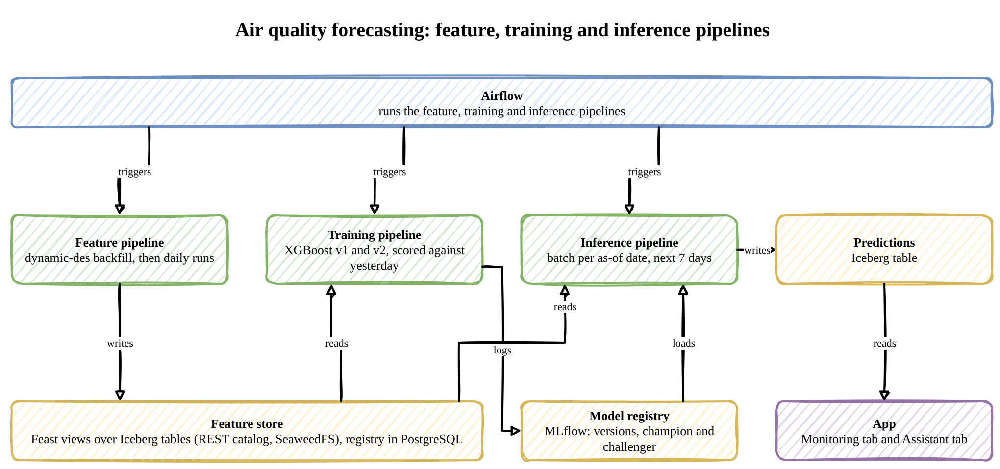
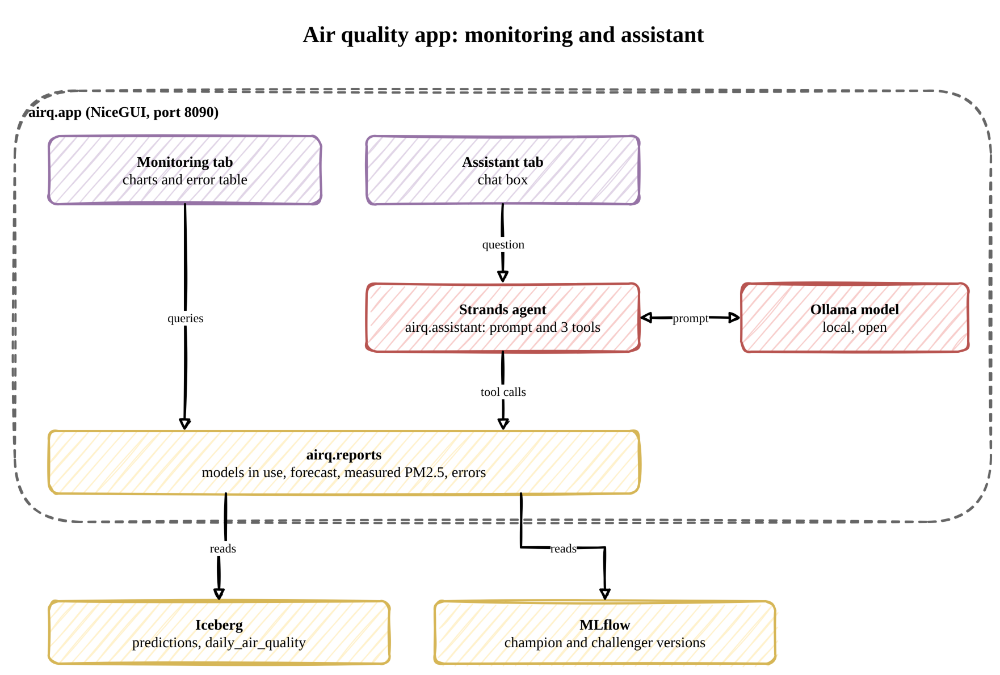

# air-quality

An ML system that forecasts daily PM2.5, a measure of fine-particle air pollution, for the next seven days from weather forecasts. It runs entirely on local services:

- **Data:** hourly weather forecasts and PM2.5 readings are simulated with [dynamic-des](https://jaehyeon-kim.github.io/dynamic-des/), a Python library that runs discrete-event simulations and writes their output to sinks such as Kafka, Parquet and Iceberg. Nothing calls an external service.
- **Storage and features:** the data lands in Apache Iceberg tables, an open table format, stored on SeaweedFS, an S3-compatible object store. Feast, a feature store, defines daily features over those tables and serves the same values to training and prediction.
- **Models:** XGBoost models are tracked in MLflow, whose model registry keeps each trained version and marks the one in use.
- **Monitoring and assistant:** a NiceGUI web app with two tabs: charts of the forecast against what was measured, and a chat with a Strands agent, running on a local open model, that answers questions about it.
- **Scheduling:** Apache Airflow runs the pipelines on a schedule.
- **Infrastructure:** [odctl](https://github.com/jaehyeon-kim/odctl), a command-line tool that starts a local data stack (Kafka, Spark, Flink, Iceberg, Airflow, MLflow, Feast and more) with Docker Compose, runs every service here.

The design follows the air quality project in Jim Dowling's [*Building Machine Learning Systems with a Feature Store*](https://www.oreilly.com/library/view/building-machine-learning/9781098165222/). [Concepts behind the design](concepts.md) explains the ideas the system is built on and where the code uses them.

## Architecture

The system is split into three pipelines that never call each other. The feature pipeline turns raw data into features, the inputs a model learns from. The training pipeline turns features into a model. The inference pipeline turns features and a model into predictions. They share data only through the feature store, which holds the features, and the model registry, which holds the models, so each can be run, scheduled and changed on its own.

Two terms in the diagram need explaining. The baseline is the simplest possible forecast, that today will be like yesterday, and every model has to beat it. An as-of date is the date a run treats as today, so a run for a past day sees only the data that existed then.



### Data

The simulation writes two hourly Apache Iceberg tables in the `airq` namespace of the REST catalog, with their files on SeaweedFS under `s3://warehouse/airq/<table>`. Both are keyed by `location_id`, a single simulated station. The pipelines build everything else from them.

`weather_forecasts`: each hour issues a forecast for the same hour 1 to 7 days ahead, so every hour ends up with seven forecasts. `issued_at` is when a forecast was made and `forecast_for` is the hour it is for. Training reads only the forecasts that existed at the time, which keeps the evaluation honest.

| Column | Type | Unit | Description |
|---|---|---|---|
| `location_id` | string | | Station the forecast is for |
| `forecast_for` | timestamp (UTC) | | Hour the forecast is for |
| `issued_at` | timestamp (UTC) | | Time the forecast was made, `lead_days` before `forecast_for` |
| `lead_days` | integer | days | How far ahead the forecast was made, 1 to 7 |
| `temperature_2m` | double | °C | Forecast air temperature 2 m above the ground |
| `precipitation` | double | mm | Forecast rain falling during the hour |
| `wind_speed_10m` | double | km/h | Forecast wind speed 10 m above the ground |
| `wind_direction_10m` | double | degrees | Forecast direction the wind blows from, 0 to 360 |
| `ingested_at` | timestamp (UTC) | | Time the row was stored, the same as `issued_at` |

`observations`: the measured PM2.5, the source of the target.

| Column | Type | Unit | Description |
|---|---|---|---|
| `location_id` | string | | Station that took the reading |
| `measured_at` | timestamp (UTC) | | Hour the reading was measured |
| `pm2_5` | double | µg/m³ | Mean concentration of fine particles, 2.5 µm or smaller, during the hour |
| `ingested_at` | timestamp (UTC) | | Time the reading was stored, an hour after `measured_at` |

## Environment setup

### Python environment

Everything Python-side installs into one virtual environment from `requirements.txt`, including the `odctl` CLI. It also installs Airflow, Feast and MLflow at the versions the containers run, so the pipelines can run locally as well. Use Python 3.13. With [uv](https://docs.astral.sh/uv/), from this directory:

```bash
uv venv                             # create .venv
source .venv/bin/activate           # activate it (each new shell; Windows: .venv\Scripts\activate)
uv pip install -r requirements.txt
```

### Services

odctl groups services into profiles, and `odctl up` starts the profiles you name. Three steps, in this order:

```bash
# 1. copy the stack config into ./.odctl
odctl init

# 2. make the Airflow container install dynamic-des and dateparser, before the first `odctl up` creates it
echo '_AIRFLOW_PIP_DEPS="dynamic-des[iceberg]>=0.14.0 dateparser==1.4.3"' >> .odctl/.env

# 3. start the profiles this project uses
odctl up catalog feast mlflow airflow
```

`odctl init` copies odctl's compose files, configs and `.env` into `./.odctl`, and `odctl up` uses that copy. Step 2 must come before the first `odctl up`, because the setting reaches the Airflow container only when it is created. Run it again after `odctl init --force`, which restores the shipped `.env`. The profiles also start PostgreSQL and SeaweedFS, and three services this project does not use: Valkey, Feast's online feature server and MLflow's model server. The model server waits idle while `MODEL_URI` in `.odctl/.env` is empty.

| Service | Internal (Docker) | External (host) | Credentials |
|---|---|---|---|
| Iceberg REST catalog | `http://catalog:8181` | `http://127.0.0.1:8181` | none |
| SeaweedFS S3 API | `http://seaweed:8333` | `http://127.0.0.1:8333` | `user` / `password` |
| PostgreSQL | `postgres:5432` | `127.0.0.1:5432` | `user` / `password` |
| Feast UI | `http://feast-ui:8888` | `http://127.0.0.1:8890` | none |
| MLflow | `http://mlflow:5000` | `http://127.0.0.1:5004` | none |
| Airflow UI | `http://airflow:8080` | `http://127.0.0.1:8085` | `user` / `password` |

### Airflow

Airflow runs every pipeline as a DAG, Airflow's name for a workflow. The DAG files are in `dags`, and Airflow reads them from `s3://airflow/dags` every 15 seconds. Upload `dags` and the `airq` package the tasks import, and upload again after changing either. `--delete` removes files you have deleted locally:

```bash
export AWS_ACCESS_KEY_ID=user AWS_SECRET_ACCESS_KEY=password AWS_DEFAULT_REGION=us-east-1
aws --endpoint-url http://127.0.0.1:8333 s3 sync . s3://airflow/dags --exclude "*" --include "airq/*.py" --include "dags/*.py" --delete
```

In the Airflow UI at http://127.0.0.1:8085 (`user` / `password`), the DAGs appear with the tag `airq`. New DAGs start paused: unpause one, then trigger it and fill in the form. The Airflow CLI in the container does the same from the terminal, and shows why a DAG is missing:

```bash
docker exec airflow airflow dags list-import-errors
```

## Step 1: v1 pipelines

Step 1 describes v1, the weather-only model. The code already includes step 2: registering the Feast views also registers v2's `calendar_v2`, and training also trains v2. [Step 2](#step-2-v2-pipelines) explains both.

### Feature pipeline

The feature pipeline writes the two hourly tables and turns them into two daily tables of features, which Feast will read.

`daily_weather`: one row per day and lead, averaged from the 24 hourly forecasts for that day. Training uses lead 1. Predicting N days ahead uses lead N, the forecast that existed at the time.

| Column | Type | Unit | Description |
|---|---|---|---|
| `location_id` | string | | Station the forecast is for |
| `day` | date | | Day the forecast is for |
| `lead_days` | integer | days | How far ahead the forecast was made, 1 to 7 |
| `issued_on` | date | | Day the forecast was made, `lead_days` before `day` |
| `temperature_2m` | double | °C | Mean forecast air temperature 2 m above the ground |
| `wind_speed_10m` | double | km/h | Mean forecast wind speed 10 m above the ground |
| `wet_hours` | integer | hours | Hours with forecast rain |

`daily_air_quality`: one row per day, with the target and the features known from the date and the day before.

| Column | Type | Unit | Description |
|---|---|---|---|
| `location_id` | string | | Station that took the readings |
| `day` | date | | Day the readings were measured |
| `pm2_5` | double | µg/m³ | Mean PM2.5 over the day's 24 readings, the target |
| `is_weekend` | boolean | | Whether the day is a Saturday or Sunday |
| `pm2_5_lag1` | double | µg/m³ | Mean PM2.5 of the day before, and the baseline's prediction |

It runs in two ways, each from the terminal or from Airflow. The same first day and seed always generate the same values. The backfill stores both on the tables, and the daily run reads them back, so the two write the same values for the same day.

- **Backfill:** drops and recreates the four tables, and drops any predictions, which were made from the data being replaced. It then generates the last `n_days` up to the end of yesterday (UTC), with `seed` (default 42). The hourly rows go through dynamic-des's Iceberg writer, and the daily rows are written with PyIceberg.
- **Daily run:** loads one day into all four tables, yesterday (UTC) by default, with the backfill's seed unless `--seed` names another. A different seed gives the day values that do not continue from the days around it. The day cannot be before the backfill's first day. Each table gets one overwrite filtered to that day, so running a day again replaces it.

Every row is checked against the bounds in `airq/models.py` as it is built, such as PM2.5 between 0 and 500, so a run stops before writing an impossible value.

Days can be named the way people say them, as well as `YYYY-MM-DD`: `yesterday`, `"3 days ago"`, `"a week ago"`, `"last monday"` or `"20 September"`, all in UTC. The same phrases work in the Airflow parameters and in the assistant. From the terminal:

```bash
python -m airq.backfill --n-days 730 --seed 42
python -m airq.daily                              # yesterday
python -m airq.daily --date "3 days ago"
python -m airq.daily --date "3 days ago" --seed 7
```

From Airflow, `dags/airq_feature_pipeline.py` defines `airq_backfill`, which runs only when triggered, with `n_days` and `seed` parameters, and `airq_daily`, which runs at 00:00 UTC for the day before, or for the day in its `date` parameter when triggered, with an optional `seed`. When `airq_daily` is first unpaused, it runs straight away for the most recent day. From the terminal:

```bash
docker exec airflow airflow dags unpause airq_backfill
docker exec airflow airflow dags trigger airq_backfill --conf '{"n_days": 730, "seed": 42}'
docker exec airflow airflow dags unpause airq_daily
docker exec airflow airflow dags trigger airq_daily --conf '{"date": "3 days ago"}'
docker exec airflow airflow dags list-runs airq_backfill       # the state of each run
```

Feast reads the daily tables through the feature view in `airq/feast_repo.py`, `weather_v1`, over `daily_weather`. Register it once, and again after changing it:

```bash
python -m airq.feast_repo
```

The Feast UI at http://127.0.0.1:8890 then shows the project `airq` with the `station` and `lead` entities and the `weather_v1` view. A request for day D at lead N returns the forecast for D issued N days before. If that row is missing, the result is empty rather than the day before's forecast, because the view keeps a row valid for 12 hours only.

### Querying with Trino (optional)

Trino is a SQL query engine, and odctl's Trino reads the same Iceberg catalog. Starting a profile adds it to what is already running:

```bash
odctl up trino
docker exec -it trino trino --catalog iceberg --schema airq
```

Without `--catalog` and `--schema`, name tables in full as `iceberg.airq.<table>`, or run `USE iceberg.airq;` first. `SHOW TABLES;` and `DESCRIBE observations;` show what is there. Run `exit` or `quit` to leave the shell.

<details>
<summary>Example queries</summary>

The span of the backfill. The last hour should be 23:00 yesterday (UTC):

```sql
SELECT count(*) AS rows, min(measured_at) AS first_hour, max(measured_at) AS last_hour
FROM observations;
```

The forecast issued at midnight yesterday, one row per lead:

```sql
SELECT lead_days, forecast_for, temperature_2m, precipitation, wind_speed_10m
FROM weather_forecasts
WHERE issued_at = date_trunc('day', current_timestamp AT TIME ZONE 'UTC') - INTERVAL '1' DAY
ORDER BY lead_days;
```

The two clocks: seven forecasts for noon yesterday, each issued on a different day:

```sql
SELECT issued_at, lead_days, temperature_2m, wind_speed_10m
FROM weather_forecasts
WHERE forecast_for = date_trunc('day', current_timestamp AT TIME ZONE 'UTC') - INTERVAL '1' DAY + INTERVAL '12' HOUR
ORDER BY issued_at;
```

Daily mean PM2.5 over the last week:

```sql
SELECT date_trunc('day', measured_at) AS day, round(avg(pm2_5), 1) AS pm2_5
FROM observations
WHERE measured_at >= date_trunc('day', current_timestamp AT TIME ZONE 'UTC') - INTERVAL '7' DAY
GROUP BY 1
ORDER BY 1;
```

PM2.5 beside the lead-1 forecast, a preview of the daily features: lower on windy or wet days:

```sql
SELECT date_trunc('day', o.measured_at) AS day,
       round(avg(o.pm2_5), 1) AS pm2_5,
       round(avg(f.wind_speed_10m), 1) AS wind,
       count_if(f.precipitation > 0) AS wet_hours
FROM observations o
JOIN weather_forecasts f ON f.forecast_for = o.measured_at AND f.lead_days = 1
WHERE o.measured_at >= date_trunc('day', current_timestamp AT TIME ZONE 'UTC') - INTERVAL '7' DAY
GROUP BY 1
ORDER BY 1;
```

The weekday effect, which weather cannot explain:

```sql
SELECT day_of_week(measured_at) >= 6 AS weekend, round(avg(pm2_5), 1) AS pm2_5
FROM observations
GROUP BY 1;
```

</details>

### Training pipeline

The training pipeline trains v1 and scores it against the baseline, which predicts today as yesterday.

- **Data:** the target, `pm2_5`, and the baseline's prediction, `pm2_5_lag1`, come from `daily_air_quality`. The features come from Feast's `weather_v1` view: for each day, the forecast issued the day before (lead 1).
- **Split:** the days are split in time order. The model trains on the earlier 80% and is tested on the last 20%, so it never sees the future.
- **Model:** an XGBoost regressor on default settings. MLflow records MAE, RMSE and R² for v1 and for the baseline on the same test days, and a feature importance plot.
- **Registry:** each run registers a new version of `airq_pm25` in MLflow and gives it the alias `champion`, which the inference pipeline loads. Step 2 adds v2 to the same run.
- **Reproducibility:** Feast does not pin table versions, so the run records the Iceberg snapshot of each table before and after reading, stops if a commit landed in between, and tags the snapshots it read so they outlive cleanup.

From the terminal:

```bash
python -m airq.train
python -m airq.infer        # so the new versions have a forecast
```

From Airflow, `dags/airq_training_pipeline.py` defines `airq_training`, which runs only when triggered. When it finishes, it starts the inference pipeline for the day before by itself:

```bash
docker exec airflow airflow dags unpause airq_training
docker exec airflow airflow dags trigger airq_training
```

The runs and registered versions are in MLflow at http://127.0.0.1:5004, under the experiment `airq` and the model `airq_pm25`.

### Inference pipeline

The inference pipeline predicts PM2.5 for the seven days after an as-of date, the date a run treats as today. Standing on day D, the forecast available is the one issued on D: lead N for day D+N. The run reads those seven rows through Feast, predicts with the `champion` model (and, from step 2, the `challenger` beside it) and writes them to the Iceberg table `predictions`. Running a date again replaces its predictions.

`predictions`: one row per as-of date and day predicted.

| Column | Type | Unit | Description |
|---|---|---|---|
| `location_id` | string | | Station the prediction is for |
| `as_of` | date | | Date the run treated as today |
| `day` | date | | Day predicted, `lead_days` after `as_of` |
| `lead_days` | integer | days | How far ahead, 1 to 7 |
| `pm2_5` | double | µg/m³ | Predicted daily mean PM2.5 |
| `model_version` | string | | Version of `airq_pm25` that made it |

When the readings for a predicted day arrive, the hindcast compares them with the predictions made earlier and reports each model version's mean absolute error by lead and by as-of date.

From the terminal, for yesterday (UTC) or a named date, then the hindcast:

```bash
python -m airq.infer
python -m airq.infer --as-of "3 days ago"
python -m airq.infer --hindcast
```

A backtest is a run for each of a range of past dates: `--days 3` runs the three as-of dates ending at `--as-of`, or at yesterday without it. The hindcast then scores the days whose readings have arrived.

From Airflow, `dags/airq_inference_pipeline.py` defines `airq_inference`. It runs each time `airq_daily` finishes loading a day, for that day, because the daily task marks the daily features updated (an Airflow asset) and the inference DAG is scheduled on it. When Airflow combines several daily runs into one inference run, it predicts for every day they loaded. It also runs after `airq_training`, for the day before, so newly registered versions have a forecast straight away. Triggered by hand, it runs for the day in its `as_of` parameter:

```bash
docker exec airflow airflow dags unpause airq_inference
docker exec airflow airflow dags trigger airq_inference --conf '{"as_of": "3 days ago"}'
```

## Step 2: v2 pipelines

Step 2 adds a second model, v2, beside v1, through the same three pipelines: a feature sweep decides v2's features, training registers both models, and inference predicts with both. It also settles whether past PM2.5 readings are worth adding as features.

### Feature pipeline

The feature sweep tests which daily features are worth adding to v1's weather features. It records everything in MLflow as one parent run named `feature-sweep` and registers nothing:

```bash
python -m airq.sweep                   # the stored data plus seeds 0 to 4
python -m airq.sweep --seeds 0 1 2
```

The stored tables hold one seed's data, so the sweep also scores every candidate on data generated in memory with other seeds, by the same generator and feature code. Every score uses the same model, `XGBRegressor()` with default settings.

**Part 1, lags at lead 1.** Each candidate adds one feature to the one before: the weekend flag, then yesterday's PM2.5 (lag 1), the day before (lag 2) and the day before that (lag 3). All are scored on the same days, on the time-ordered split and on a random split of the same size. MAE on daily PM2.5, µg/m³:

| Candidate | stored, time-ordered | mean of 6 data sets, time-ordered | stored, random split | mean, random split |
|---|---|---|---|---|
| weather | 1.98 | 1.87 | 1.83 | 1.89 |
| weather and weekend | 0.72 | 0.69 | 0.76 | 0.68 |
| plus lag 1 | 0.74 | 0.70 | 0.76 | 0.68 |
| plus lags 1 and 2 | 0.77 | 0.70 | 0.74 | 0.68 |
| plus lags 1 to 3 | 0.73 | 0.72 | 0.75 | 0.69 |

The sweep chooses the smallest set after which adding the next candidate lowers the mean MAE by less than 5%: the weather and the weekend flag. The weekend flag cuts the error by nearly two thirds, because the simulation raises PM2.5 on weekdays and the weather cannot show that. None of the lags helps.

**Part 2, lags at every lead.** A lag can only be used if its reading exists when the forecast is made. Standing on day D, the latest reading is D's own, so a forecast for day D+N can use a lag of N days at best. For each lead N, the sweep scores the lead-N weather forecast and the weekend flag with and without that lag (mean MAE over the six data sets):

| Lead (days) | 1 | 2 | 3 | 4 | 5 | 6 | 7 |
|---|---|---|---|---|---|---|---|
| lag available | 1 | 2 | 3 | 4 | 5 | 6 | 7 |
| without the lag | 0.71 | 0.75 | 0.81 | 0.80 | 0.91 | 0.89 | 0.89 |
| with the lag | 0.70 | 0.74 | 0.81 | 0.81 | 0.88 | 0.85 | 0.92 |

The lag changes the error by 0.04 at most, up or down, at every lead. The error without it grows with the lead, because the weather forecast gets less accurate further ahead. The figures move a little with the days the backfill covers.

So v2 is the weather and the weekend flag. Feast serves the flag through a second view, `calendar_v2`, an on-demand view that computes it from the day each request names (see [Three kinds of data transformation](concepts.md#three-kinds-of-data-transformation)). A view over `daily_air_quality` would not work, because that table has rows only for days already measured, and inference predicts days that have not happened yet. `weather_v1` is unchanged beside it. Register both views:

```bash
python -m airq.feast_repo
```

The Feast UI then also shows `calendar_v2` under on-demand feature views.

### Training pipeline

The same command and DAG as in step 1 train both models in one MLflow run named `training`, with a nested run per model:

- **v1:** the weather features.
- **v2:** the weather features and the weekend flag.

Each version carries a `feature_set` tag, `v1` or `v2`, which tells inference what to give it. The new version of the feature set the champion already uses becomes the new `champion`, and the other becomes the `challenger`. The champion is v1 until v2 is promoted, and a promotion survives retraining.

Each model is also trained and tested on a random split of the same size, and the run logs both scores as the table `split_comparison.json` (MAE, µg/m³):

| Model | time-ordered split | random split |
|---|---|---|
| baseline, today as yesterday | 3.40 | 3.75 |
| v1 | 2.06 | 1.87 |
| v2 | 0.71 | 0.71 |

The time-ordered split is the honest one: a forecast only ever predicts days after the ones it learnt from. A random split puts days from the test period into training, which flatters v1 here. Its effect on the lag candidates in part 1 is small and goes both ways, because in this simulation yesterday's reading carries little the weather does not.

v2 beats v1 on both splits and at every lead in the hindcast below. To make it the model in use, move the `champion` alias in the MLflow UI, or:

```bash
python -c "import airq.config, mlflow; mlflow.MlflowClient().set_registered_model_alias('airq_pm25', 'champion', '<v2 version>')"
```

Straight after a promotion, one version holds both aliases; inference predicts with it once, and the app shows it under both names. The next training run gives the challenger to the new v1.

### Inference pipeline

Inference predicts with the champion and, when it is a different version, the challenger. Each model reads the feature set its version is tagged with, and both write to `predictions`, told apart by `model_version`. The hindcast reports each version separately.

The horizon check asks whether each feature exists at every lead when the forecast is made. The weather forecast does, since lead N is issued N days ahead. The weekend flag does, since it follows from the date. A past reading exists only up to the day the forecast is made, which is part 2 of the sweep. v2 has no lag, so one model serves all seven leads.

A backtest runs inference for a range of past as-of dates. Run one, then read the error by lead in the app's Monitoring tab, or for all predictions at once with the hindcast:

```bash
python -m airq.infer --days 60
python -m airq.infer --hindcast
```

The backtest's 60 days fall inside the last 146 days that training held out for testing, so neither model trained on them. The Monitoring tab's error by lead over the last 30 measured days (MAE, µg/m³):

| Lead (days) | 1 | 2 | 3 | 4 | 5 | 6 | 7 |
|---|---|---|---|---|---|---|---|
| v1 (champion) | 1.75 | 1.64 | 1.71 | 1.83 | 2.07 | 1.66 | 1.86 |
| v2 (challenger) | 0.64 | 0.78 | 0.75 | 0.59 | 0.94 | 0.93 | 1.06 |

### Should the model use past PM2.5 readings?

No. Part 1 of the sweep adds lags 1, 2 and 3 in turn, and part 2 scores each lag at the lead where it is actually available. On this data none of them improves the model at any lead: the weather forecast and the weekend flag already explain what a past reading would. This follows from how the data is simulated: PM2.5 depends on the day's weather and the weekday plus independent noise, with nothing carried over from the day before beyond the weather itself.

Past readings would also bring these risks:
- **Not available far enough ahead.** A reading exists only up to the day the forecast is made, so lag 1 serves only the first day of a seven-day forecast. Later days need either a model per lead with a lag that respects it (part 2 above), or the model's own predictions as the lag.
- **Feeding back predictions compounds errors.** Using the model's day-one prediction as the lag for day two, and so on, carries each error into the next day's input.
- **Missing readings.** When a sensor fails, the lag is missing when the forecast is made, so the inference pipeline needs a rule for it: skip the forecast, fill the value, or fall back to a model without the lag. A model without lags keeps forecasting through an outage.
- **Timing.** The feature for day D+1 needs all of day D's readings. The last one arrives at 00:00 UTC, exactly when the daily run starts, so a late reading would leave the lag wrong or missing.
- **Leakage in evaluation.** With a random split, the day before a test day often sits in the training set, so a lag lets the model score well without learning anything that holds for the future. The time-ordered split in every table above avoids this.

## Step 3: Monitoring and assistant

Step 3 adds one web app for people to use the forecast. It is built with [NiceGUI](https://nicegui.io/), a Python framework that serves both the page and the code behind it from one process, so there is no separate front end. The app has two tabs:

- **Monitoring:** charts of the forecast against what was measured, and how accurate each model has been.
- **Assistant:** a chat that answers questions about the forecast in plain language, such as "what is the forecast for tomorrow?".



Both tabs read the same queries in `airq/reports.py`, so a number in the chat always matches the charts. Nothing in the app writes data: the pipelines in steps 1 and 2 produce everything it shows.

| File | What it holds |
|---|---|
| `airq/app.py` | the page, its two tabs and the chat box |
| `airq/assistant.py` | the agent: its tools, its prompt and the model it uses |
| `airq/reports.py` | the queries both tabs share, over Iceberg and MLflow |

### Before you start

The app needs three things in place:

1. **The odctl services running,** as in [Services](#services).
2. **Predictions to show.** A daily inference run gives one forecast. A backtest gives the history the charts and the error table need, so run one after training in step 2:

   ```bash
   python -m airq.infer --days 60
   ```

3. **Ollama running with the assistant's model.** [Ollama](https://ollama.com/) runs open language models on your own machine. Start it with the desktop app or `ollama serve`, then pull the default model once:

   ```bash
   ollama pull qwen3:4b-instruct
   ```

### Running the app

```bash
python -m airq.app
```

Open http://127.0.0.1:8090. Stop it with Ctrl+C. The header shows the station, the model versions in use (for example `@champion: v5, v1 features` and `@challenger: v6, v2 features`) and the two tabs.

To run the assistant on another Ollama model that supports tool calls, pull it and name it in `AIRQ_MODEL`:

```bash
ollama pull <model>
AIRQ_MODEL=<model> python -m airq.app
```

### Monitoring tab

The tab shows, from top to bottom:

- **Forecast against measured:** the measured daily PM2.5 over the last 60 days as a solid line, each model's prediction made one day ahead for the same days, and each model's latest seven-day forecast as a dashed line continuing past the last measured day. Where a model's line stays close to the measured one, it has been predicting well.
- **Daily error:** the absolute error of each model's one-day-ahead prediction, one bar per day, so a bad day or a drifting model stands out.
- **Error by lead:** each model's mean absolute error over the last 30 measured days for predictions made 1 to 7 days ahead. Errors usually grow with the lead, because the weather forecast behind them gets less accurate.

**Refresh** reloads the header and the charts after a new daily run, without reloading the page. Training metrics stay in MLflow at http://127.0.0.1:5004, so the tab does not repeat them. When the challenger keeps a lower error, promote it as described in step 2's training pipeline.

### Assistant tab

Type a question and press Enter. The answer appears word by word as the model writes it.

The chat is a [Strands](https://strandsagents.com/) agent: a language model that answers by calling Python functions, called tools, and writing its answer from what they return. For each question, the model picks a tool and its arguments, the tool reads Iceberg and MLflow through `airq/reports.py`, and the model turns the result into a sentence. It never sees the tables directly, so every number it gives comes from a tool.

| Tool | Arguments | Returns |
|---|---|---|
| `get_forecast` | a day (empty for all seven), and `champion` or `challenger` | the latest forecast from that model, with its version and the date it was made |
| `get_observed` | a day, or a first and last day | measured daily PM2.5, and for a range the highest, lowest and mean |
| `get_model_error` | how many recent days to score (default 30) | each model's error by lead, and which one is lower at each lead |

Questions can name days the way people do. The tools turn the phrase into a date in Python, so the model never does date arithmetic:

| Phrase | Means |
|---|---|
| `today`, `yesterday`, `tomorrow` | as written, in UTC |
| `3 days ago`, `three days ago`, `a week ago`, `2 weeks ago`, `in 2 days` | counted from today |
| `day before yesterday`, `the day after tomorrow` | as written |
| `saturday` | for a forecast, the next Saturday; for a reading, the last one; today if it is Saturday |
| `next saturday`, `last monday` | the one after today, or the one before today |
| `this weekend`, `last weekend` | the Saturday of this weekend, or of the one before |
| `20 September`, `Sep 20`, or `YYYY-MM-DD` | that date; without a year, the nearest one in the past for a reading and in the future for a forecast |

`airq/days.py` reads these; the command-line tools and the Airflow parameters use the same code.

Questions it answers well:

- What is the forecast for tomorrow?
- What does the challenger predict for Saturday?
- Will PM2.5 be higher on Saturday than tomorrow?
- What was PM2.5 three days ago?
- What was the highest PM2.5 over the last seven days?
- Which model has been more accurate over the last 30 days?

It answers only from these three tools, so it cannot explain why a value is high or answer questions about other places. Readings for a day arrive with the daily run after midnight UTC, so "today" has no measured value yet, and the assistant says so. Each browser tab holds its own conversation, and reloading the page starts a new one.

### Choosing and fixing the model

The default model is `qwen3:4b-instruct`, a small model that answers without a reasoning pass. Plain `qwen3:4b` is the same size but reasons before every answer, which makes it much slower. The tools do the work that small models get wrong: they turn day phrases into dates, return only the rows a question needs as a few short lines instead of tables, and state comparisons such as the highest day or the more accurate model instead of leaving the model to work them out. The prompt tells the model to copy numbers exactly, to pass days in the user's own words and to answer the question directly.

When an answer comes out wrong, fix the agent rather than moving to a larger model. Find which tool it called and with what arguments, then change the tool's description, what the tool returns, or the prompt, all in `airq/assistant.py`.

### Troubleshooting

| What you see | Cause and fix |
|---|---|
| The chat shows `The assistant failed: All connection attempts failed` | Ollama is not running: start the desktop app or `ollama serve`. |
| The chat shows `The assistant failed: model '...' not found` | The model has not been pulled: run `ollama pull` with the name in `AIRQ_MODEL`, or the default. |
| The charts or the error table are empty | No predictions yet: run the inference pipeline or the backtest in [Before you start](#before-you-start). |
| The header shows no model versions | No model is registered: run the training pipeline in step 2. |

## Tests

The tests run without the odctl services:

```bash
python -m pytest tests
```

GitHub runs them, with the repository's lint checks, on every push to `main` (see [Checks](../README.md#checks)).

The tests check that:
- the daily run's rows for a day match the feature code's rows for that day over the whole generated span, and the same seed gives the same data;
- v2 beats v1, which beats the baseline, on the registered feature sets;
- rows outside the value bounds are refused;
- Feast's point-in-time join returns each day's own forecast at each lead, and nothing for a missing day;
- the weekend flag, the feature sets, the time-ordered and random splits and the sweep's choice behave as described;
- inference asks for the forecast issued on the as-of date, and the error join covers only days with a reading;
- a version holding both aliases is shown under each, and the lower error is named correctly;
- day phrases resolve to the right dates, and the assistant's tools return the right lines.

## Tear down environment

```bash
odctl down --all --volumes
deactivate
rm -rf .venv
```

`--volumes` deletes the data with the containers.
