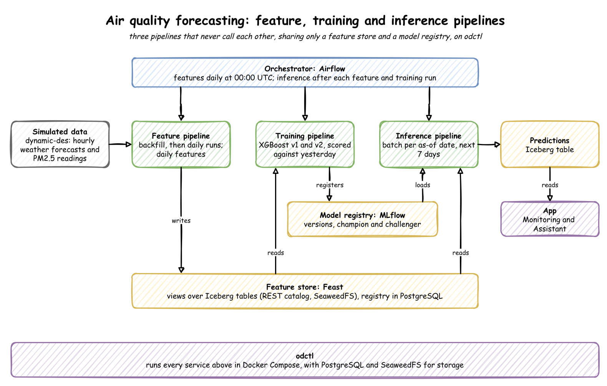
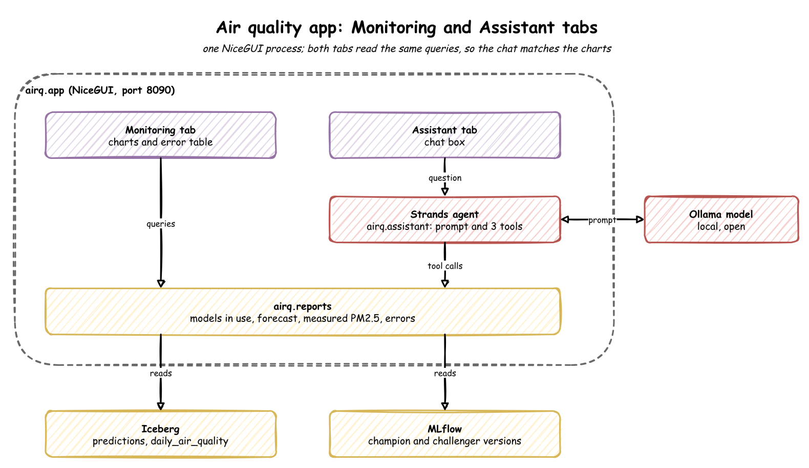

# air-quality

An ML system that forecasts daily PM2.5, a measure of fine-particle air pollution, for the next seven days from weather forecasts. Everything runs on your own machine, and no step calls an external service.

The design follows the air quality project in Jim Dowling's [*Building Machine Learning Systems with a Feature Store*](https://www.oreilly.com/library/view/building-machine-learning/9781098165222/).

More detail is in three documents:

- [Concepts](docs/concepts.md): the ideas the system is built on, and where the code uses them.
- [Data](docs/data.md): every table's columns, and example queries.
- [Results](docs/results.md): how accurate each model is, and why v2 has the features it has.

## Architecture



Three pipelines do the work, and they never call each other:

- The **feature pipeline** turns simulated weather forecasts and PM2.5 readings into daily features.
- The **training pipeline** trains a model on those features.
- The **inference pipeline** predicts the next seven days with the trained model.

They share only two stores. The **feature store** holds the features, so training and prediction read the same values. The **model registry** holds every trained model and marks the one in use. [Concepts](docs/concepts.md#feature-training-and-inference-pipelines) explains why the pipelines are split this way.

### What you will build

**Step 1: v1, end to end**

1. Backfill two years of history, up to yesterday.
2. Register v1's features.
3. Train v1. It becomes the model in use, called the champion.
4. Forecast the next seven days.
5. Load today's data, then forecast again.
6. Do the same for tomorrow.
7. Score v1's forecasts against what was measured.

**Step 2: v2, improving the model with more features**

1. Run a feature sweep. It chooses a weekend flag and rejects past PM2.5 readings.
2. Register v2's features.
3. Train v2. It becomes the challenger, which predicts beside the champion.
4. Backtest both models over the last 60 days.
5. Compare their errors.
6. Promote v2 to champion.

**Step 3: monitoring and assistant**

1. Open the monitoring tab, which charts both models against the measured values.
2. Ask the assistant a question.
3. Load another day, forecast, and refresh the app.

Steps 1 to 3 run from the terminal. [Running the pipelines in Airflow](#running-the-pipelines-in-airflow) then runs the same steps on a schedule.

To start again at any point, `python -m airq.stores.cleanup` removes everything this project has created and keeps the services running. See [Clean up](#clean-up).

The three forecasts compared:

| Forecast | Predicts from |
|---|---|
| baseline | yesterday's measured PM2.5, used as today's prediction |
| v1 | the weather forecast: temperature, wind speed and hours of rain |
| v2 | the weather forecast plus a weekend flag |

The baseline is not a trained model. It is the error a model has to beat.

### Tools

| Tool | Role here |
|---|---|
| [dynamic-des](https://github.com/jaehyeon-kim/dynamic-des) | simulates hourly weather forecasts and PM2.5 readings, and writes all four feature tables |
| Apache Iceberg on SeaweedFS | stores every table; Iceberg is an open table format, and SeaweedFS is an S3-compatible object store |
| Feast | the feature store |
| XGBoost | the models |
| MLflow | tracks training runs, and is the model registry |
| Apache Airflow | runs the pipelines on a schedule |
| NiceGUI, Strands and Ollama | the web app, its chat agent, and the local language model the agent uses |
| [odctl](https://github.com/jaehyeon-kim/odctl) | starts all the services above with Docker Compose |

## Environment setup

You need Docker, [uv](https://docs.astral.sh/uv/) and Python. Run every command from this folder.

### Python environment

One virtual environment holds everything, including the `odctl` command:

```bash
uv venv                             # create .venv
source .venv/bin/activate           # activate it, in each new shell
uv pip install -r requirements.txt
```

### Services

```bash
# 1. copy odctl's configuration into ./.odctl
odctl init

# 2. make the Airflow container install the packages the pipelines need
printf '\n_AIRFLOW_PIP_DEPS="dynamic-des[iceberg]>=0.15.0 dateparser==1.4.3"\n' >> .odctl/.env

# 3. start the services
odctl up catalog feast mlflow airflow
```

Run step 2 before the first `odctl up`, because Airflow reads the setting only when its container is created.

The web UIs:

- Airflow: http://127.0.0.1:8085, log in as `user` / `password`
- MLflow: http://127.0.0.1:5004
- Feast: http://127.0.0.1:8890
- SeaweedFS file browser: http://127.0.0.1:8889

The code also connects to the Iceberg catalog, SeaweedFS's S3 API and PostgreSQL. [`airq/core/config.py`](./airq/core/config.py) sets their addresses, so there is nothing to configure.

## Step 1: v1 pipelines

v1 predicts PM2.5 from the weather forecast alone. This step builds it end to end: data, features, a trained model and daily forecasts.

### Backfill the history

The feature pipeline writes four Iceberg tables in the `airq` namespace:

- `weather_forecasts` and `observations`: the simulated hourly forecasts and PM2.5 readings.
- `daily_weather`: the forecast for each day, averaged over its 24 hours. It has one row for each day and lead, where the lead is how many days ahead the forecast was made (1 to 7).
- `daily_air_quality`: each day's mean PM2.5, which is what the models predict, with the weekend flag and the previous day's mean.

The data is for one simulated station. [Data](docs/data.md) lists every column, and has queries to look at the tables.

One command, `python -m airq.feature.load`, does both the backfill and the daily run. It loads `--n-days` of data ending with `--until`, which defaults to yesterday (UTC). With `--reset`, it first recreates the tables, which replaces any data already there, and deletes the predictions made from it. A dynamic-des simulation writes all four tables: each hour's forecasts and reading, and each day's daily rows when the day ends. The data is generated from a seed (default 42), so the same seed always gives the same values:

```bash
python -m airq.feature.load --n-days 730 --seed 42 --reset
```

Every row is checked as it is built, against bounds such as PM2.5 between 0 and 500, so a run stops before it writes an impossible value. The bounds are in `airq/core/models.py`.

### Register v1's features

Feast is the feature store. It serves features to training and inference through a **feature view**, a named set of features that a model reads. v1 reads one view, `weather_v1`: the temperature, wind speed and hours of rain in `daily_weather`. It is defined in `airq/stores/feature_store.py`. Register it once, and again after changing it:

```bash
python -m airq.stores.feature_store --version v1
```

The Feast UI at http://127.0.0.1:8890 then shows the project `airq` with the `weather_v1` view.

### Train v1

The training pipeline trains v1 and registers it in MLflow as a new version of the model `airq_pm25`:

- **Data:** each day's measured PM2.5, with the forecast issued the day before (lead 1).
- **Test days:** the last 20% of days are held out. The model trains on the earlier days, so it never sees the days it is tested on.
- **Scores:** MAE, RMSE and R² for v1 and for the baseline, on the same test days. MAE, the mean absolute error, is how far a prediction is from the measured value, on average. The run also logs a feature importance plot.
- **Alias:** an alias is a name that points at one version. The first version registered becomes the `champion`, which the inference pipeline uses. Training v1 again makes the new version the champion.
- **Reproducibility:** the run records which snapshot of each Iceberg table it read, and keeps those snapshots, so the same training data can be read again later.

```bash
python -m airq.training.train --version v1
```

The run is in MLflow at http://127.0.0.1:5004, under the experiment `airq`.

### Forecast

Each inference run treats one date as today, called the **as-of date**, and predicts the seven days after it. It reads the forecasts made on that date through Feast, predicts with the champion, and writes the results to the Iceberg table `predictions`. Running a date again replaces its predictions.

```bash
python -m airq.inference.infer                                 # as of yesterday: today and the six days after it
```

### Load a day and forecast again

Without `--reset`, the same command adds days to the existing tables: one day, yesterday, by default. It uses the backfill's seed and first day, which the backfill stored on the tables, so it continues the same data. It simulates only that day with dynamic-des, and upserts its rows on each table's keys, so running a day again replaces it.

Because the data is simulated, the daily run can also load days that have not happened yet. That lets you move time forward one day at a time:

```bash
python -m airq.feature.load --until today             # load today
python -m airq.inference.infer --as-of today                   # forecast the seven days after it
python -m airq.feature.load --until tomorrow          # load the next day
python -m airq.inference.infer --as-of tomorrow
```

A day can be written as `YYYY-MM-DD` or as people say it: `today`, `yesterday`, `"3 days ago"`, `"last monday"` or `"20 September"`, all in UTC. The Airflow parameters and the app's chat accept the same phrases.

### Score the forecasts

The hindcast compares the predictions with the PM2.5 measured since, and reports each model version's mean absolute error by lead:

```bash
python -m airq.inference.infer --hindcast
```

## Step 2: v2 pipelines

v2 improves v1 with more features. This step finds which features help, adds them, and compares v2 with v1 before putting it in use.

### Choose the features

The feature sweep tests which daily features to add to the weather. It adds one candidate at a time, and scores each set with the same model on the same days. It records its results in MLflow as a run named `feature-sweep`, and registers no model:

```bash
python -m airq.training.sweep
```

It finds that a weekend flag cuts the error by about 60%, because the simulation raises PM2.5 on weekdays. Past PM2.5 readings, from one to seven days back, add nothing. So v2 is the weather plus the weekend flag. The measurements are in [Results](docs/results.md).

### Register v2's features

v2 reads two views, defined in `airq/stores/feature_store.py`:

| View | Features | Used by |
|---|---|---|
| `weather_v1` | temperature, wind speed and hours of rain, from `daily_weather` | v1 and v2 |
| `calendar_v2` | the weekend flag | v2 only |

The two views get their values in different ways:

| | Stored feature: `weather_v1` | On-demand feature: `calendar_v2` |
|---|---|---|
| Computed | by the feature pipeline, before anyone asks | by Feast, each time training or inference asks |
| Computed from | the hourly weather forecasts | the date of the day asked for |
| Kept | in the Iceberg table `daily_weather` | nowhere |

The weekend flag has to be computed on demand, because inference predicts days that have no stored row yet. [Concepts](docs/concepts.md#three-kinds-of-data-transformation) explains why.

Register v2's views. `weather_v1` is unchanged, so v1 keeps working:

```bash
python -m airq.stores.feature_store --version v2
```

### Train v2

Training v2 works as for v1, on the same test days, and scores the baseline again. v2 has a different feature set from the champion, so it becomes the `challenger`. Inference then predicts with both models, and writes both to `predictions`, told apart by `model_version`:

```bash
python -m airq.training.train --version v2
```

### Compare v1 and v2

A backtest runs inference for each of a range of past dates, so both models have predictions for days that have been measured. The hindcast then scores them:

```bash
python -m airq.inference.infer --days 60                       # each of the last 60 days
python -m airq.inference.infer --hindcast
```

On the held-out test days of the run in [Results](docs/results.md#test-scores), the mean absolute error is 3.70 for the baseline, 1.95 for v1 and 0.77 for v2. Other backfills give other figures, in the same order.

### Promote v2

Promotion swaps the two aliases: v2 becomes the champion, and v1 becomes the challenger. Inference keeps predicting with both, so the app can still compare them.

```bash
python -m airq.stores.model_registry promote
python -m airq.inference.infer                                 # forecast with v2 as the champion
```

A promotion carries over to later training runs: training v2 again keeps it the champion, and training v1 again makes the new v1 the challenger.

## Step 3: Monitoring and assistant

One web app, built with [NiceGUI](https://nicegui.io/), a Python framework that serves a web page and the code behind it from one process. It has two tabs:

- **Monitoring:** the forecast against what was measured, and how accurate each model has been.
- **Assistant:** a chat that answers questions about the forecast, such as "what is the forecast for tomorrow?".



Both tabs use the same queries, in `airq/app/reports.py`, so a number in the chat always matches the charts.

### Before you start

1. **Predictions to show:** the backtest from Step 2, `python -m airq.inference.infer --days 60`.
2. **Ollama, with the assistant's model.** [Ollama](https://ollama.com/) runs open language models on your own machine. Start the desktop app or `ollama serve`, then pull the model once:

   ```bash
   ollama pull qwen3:4b-instruct
   ```

### Running the app

```bash
python -m airq.app.ui
```

Open http://127.0.0.1:8090. The header shows the model versions in use. To use another Ollama model that supports tool calls, pull it and start the app with `AIRQ_MODEL=<model> python -m airq.app.ui`.

### Monitoring tab

- **Forecast against measured:** the measured PM2.5 over the last 60 days, each model's one-day-ahead predictions for those days, and each model's latest seven-day forecast as a dashed line.
- **Daily error:** each model's one-day-ahead error, one bar per day.
- **Error by lead:** each model's average error over the last 30 days, for predictions made 1 to 7 days ahead.

### Assistant tab

Type a question and press Enter. The chat is a [Strands](https://strandsagents.com/) agent with three tools: `get_forecast`, `get_observed` and `get_model_error`. The model answers each question by calling one of them, so every number comes from the data ([Concepts](docs/concepts.md#language-models-with-tools) explains how). The agent is in `airq/app/assistant.py`.

Questions it answers well:

- What is the forecast for tomorrow?
- Will PM2.5 be higher on Saturday than tomorrow?
- What was the highest PM2.5 over the last seven days?
- Which model has been more accurate over the last 30 days?

The default model, `qwen3:4b-instruct`, is small. If an answer is wrong, improve the tools or the prompt in `airq/app/assistant.py` rather than switching to a larger model.

### Load another day

With the app open, load a day and forecast from it in another terminal:

```bash
python -m airq.feature.load --until "in 2 days"
python -m airq.inference.infer --as-of "in 2 days"
```

Press **Refresh** in the app, and the charts move forward one day.

### Troubleshooting

| What you see | Cause and fix |
|---|---|
| The chat shows `The assistant failed: All connection attempts failed` | Ollama is not running: start the desktop app or `ollama serve`. |
| The chat shows `The assistant failed: model '...' not found` | The model has not been pulled: run `ollama pull` with the name in `AIRQ_MODEL`, or the default. |
| The charts or the error table are empty | There are no predictions yet: run the backtest in [Before you start](#before-you-start). |
| The header shows no model versions | No model is registered: run the training pipeline. |

## Running the pipelines in Airflow

Airflow runs the same pipelines as DAGs, its name for workflows, and runs them on a schedule. It is an alternative to the terminal commands in Steps 1 and 2: its backfill replaces the data those commands wrote. Run `python -m airq.stores.cleanup` first to start from an empty stack ([Clean up](#clean-up)).

Airflow loads DAGs from the bucket `s3://airflow/dags`, and checks it for changes every 15 seconds. Copy the `dags` folder and the `airq` package its tasks import there, and copy them again whenever you change either:

```bash
export AWS_ACCESS_KEY_ID=user AWS_SECRET_ACCESS_KEY=password AWS_DEFAULT_REGION=us-east-1
aws --endpoint-url http://127.0.0.1:8333 s3 sync . s3://airflow/dags --exclude "*" --include "airq/*.py" --include "dags/*.py" --delete
```

`--delete` removes files you have deleted locally.

The DAGs:

| DAG | Runs | Parameters |
|---|---|---|
| `airq_features` | every day at 00:00 UTC, for the day before, one run at a time | `n_days` (1), `until`, `seed` and `reset`: when triggered |
| `airq_training` | when triggered | `version` (v1 or v2, default v1) |
| `airq_inference` | after each `airq_features` run, for the last day it loaded, and after each `airq_training` run, for the day before | `as_of`: when triggered |

The steps map onto them in the same order:

| Step | DAG | Parameters |
|---|---|---|
| Backfill the history | `airq_features` | `{"n_days": 730, "seed": 42, "reset": true}` |
| Train v1 | `airq_training` | `{"version": "v1"}` |
| Load a day | `airq_features` | `{"until": "today"}` |
| Train v2 | `airq_training` | `{"version": "v2"}` |
| Promote v2 | none: run `python -m airq.stores.model_registry promote` | |

Registering the features with `python -m airq.stores.feature_store` also stays a terminal command, before each training step. Inference has no step of its own, because Airflow starts it after each daily run and each training run.

In the Airflow UI at http://127.0.0.1:8085 (`user` / `password`), the DAGs appear with the tag `airq`. New DAGs start paused: unpause one, then trigger it. When `airq_features` is first unpaused, it runs straight away for the most recent day.

The same from the terminal, in this order. Wait for each run to show `success` before you start the next, because each one reads what the one before it wrote:

```bash
# 1. the backfill; the scheduled run for yesterday goes first, then this one
docker exec airflow airflow dags unpause airq_features
docker exec airflow airflow dags trigger airq_features --conf '{"n_days": 730, "seed": 42, "reset": true}'
docker exec airflow airflow dags list-runs airq_features        # wait for success

# 2. v1's training; inference follows by itself
python -m airq.stores.feature_store --version v1
docker exec airflow airflow dags unpause airq_inference
docker exec airflow airflow dags unpause airq_training
docker exec airflow airflow dags trigger airq_training --conf '{"version": "v1"}'
docker exec airflow airflow dags list-runs airq_inference       # wait for success

# 3. the daily run; inference follows by itself
docker exec airflow airflow dags trigger airq_features --conf '{"until": "today"}'
docker exec airflow airflow dags list-runs airq_inference       # wait for success

# 4. v2's training; inference follows by itself
python -m airq.stores.feature_store --version v2
docker exec airflow airflow dags trigger airq_training --conf '{"version": "v2"}'
docker exec airflow airflow dags list-runs airq_inference       # wait for success

# 5. promotion
python -m airq.stores.model_registry promote
```

If a DAG is missing, `docker exec airflow airflow dags list-import-errors` shows why.

Each command also prints OpenTelemetry warnings and errors, because odctl turns on Airflow's metrics without starting the service that collects them. They do no harm. To hide them, add `-e AIRFLOW__METRICS__OTEL_ON=False` after `docker exec`.

## Tests

The tests need none of the services:

```bash
python -m pytest tests
```

They cover the simulation and feature code, the value bounds, Feast's point-in-time join, the training splits, the sweep's choice, inference, the champion and challenger handling, day phrases, the assistant's tools, and which DAG files the clean-up deletes. GitHub runs them, after the repository's lint checks, on every push to `main`.

## Clean up

`python -m airq.stores.cleanup` removes everything this project has written, and keeps the services running:

- **Airflow:** the DAG files in `s3://airflow/dags`, then the DAGs and their run history.
- **MLflow:** the model `airq_pm25`, and the runs and files of the experiment `airq`. The experiment stays, empty, because MLflow does not let a deleted experiment's name be used again.
- **Feast:** the project `airq`, with its entities and views.
- **Iceberg:** the tables in the `airq` namespace, the namespace, and their files in SeaweedFS.

It touches nothing else on the stack. Run it to retry the steps from the start, without restarting the services:

```bash
python -m airq.stores.cleanup
```

## Tear down

```bash
odctl down --all --volumes          # answer y; --volumes also deletes the data
deactivate
rm -rf .venv
```
