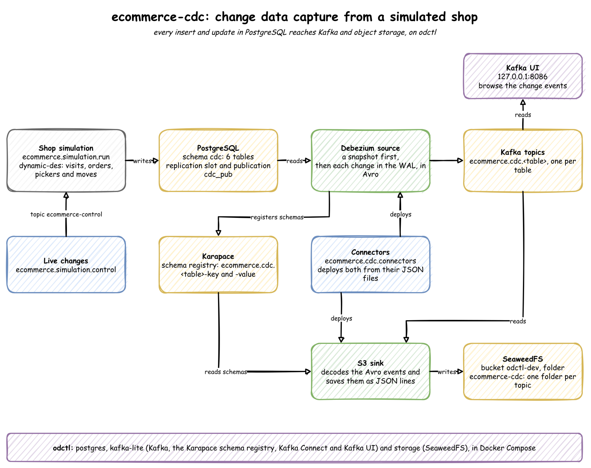
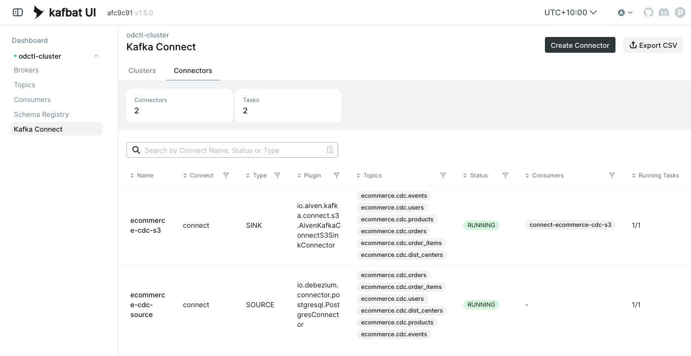
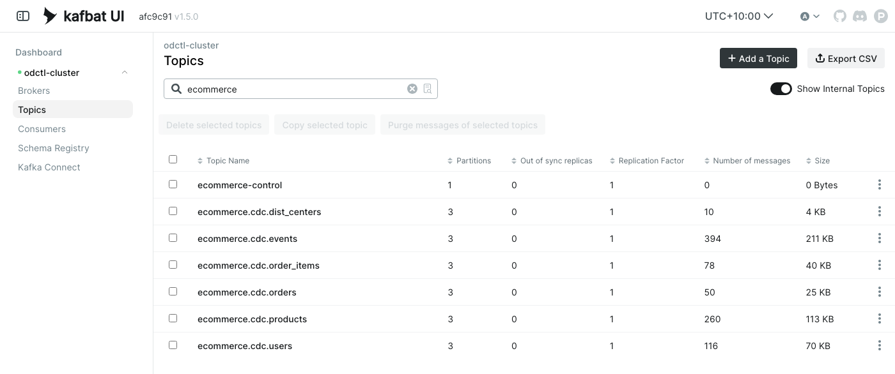
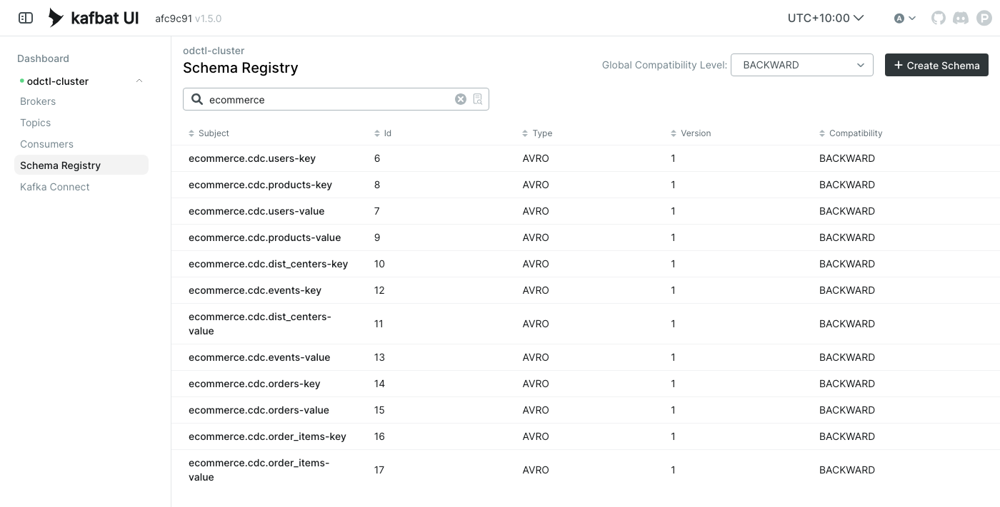
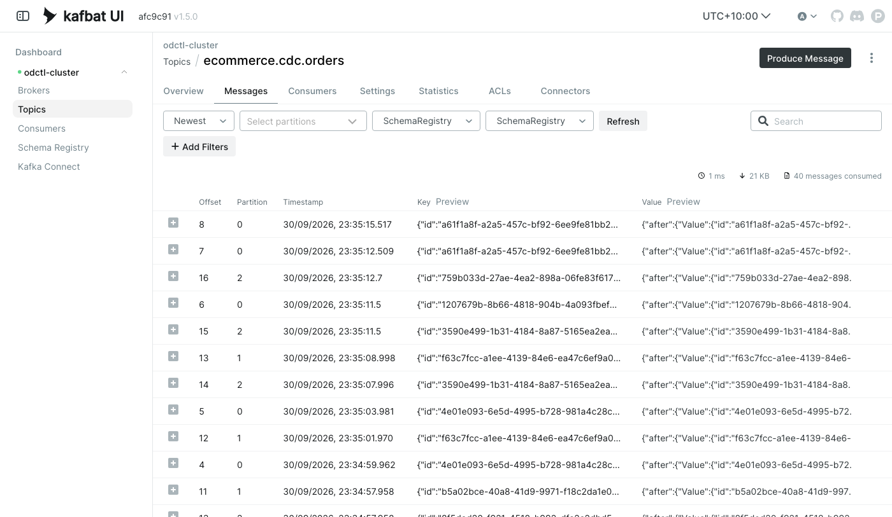
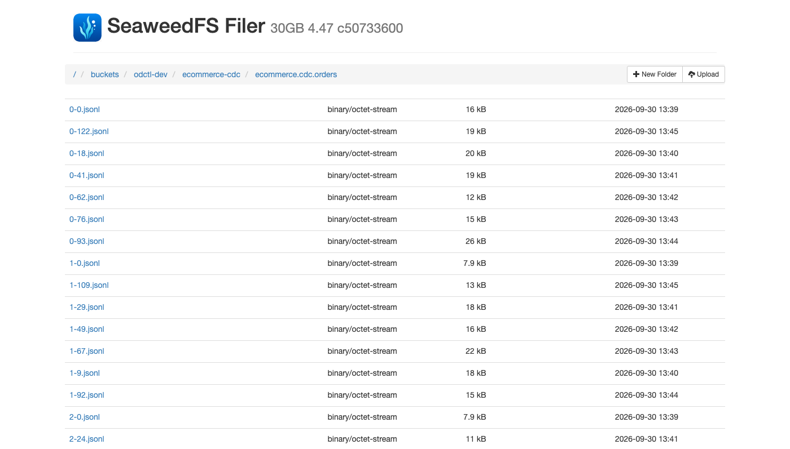

# ecommerce-cdc

Change data capture (CDC) on a simulated online shop. A simulation writes the shop's activity to PostgreSQL in real time: new users, orders and page views, and updates when an order changes status or a user moves address. Debezium reads every change from PostgreSQL's log and sends it to Kafka, and a sink connector saves the changes as files in object storage. Everything runs on your own machine.

The shop's tables follow the [theLook eCommerce](https://console.cloud.google.com/marketplace/product/bigquery-public-data/thelook-ecommerce) dataset.

More detail is in two documents:

- [Concepts](docs/concepts.md): how CDC, Debezium, Kafka Connect, Avro and the simulation work, explained from the start.
- [Data](docs/data.md): every table's columns, the topics and schemas, and a full change event.

## Architecture



Three parts do the work:

- **Simulation:** the shop itself. It writes rows to six PostgreSQL tables, and changes them as orders move on.
- **Debezium:** reads each change from PostgreSQL's write-ahead log, the record of every change the database makes, and writes it to a Kafka topic for its table.
- **S3 sink:** reads those topics and saves the changes as files in SeaweedFS.

The simulation never writes to Kafka. It only writes to its database, and every change still reaches Kafka. That is the point of CDC, which [Concepts](docs/concepts.md#change-data-capture-and-the-write-ahead-log) compares with querying the tables for changes.

### What you will build

1. Run the simulation, which fills the tables and keeps changing them.
2. Deploy the two connectors. Debezium takes a snapshot of the existing rows, then streams every insert and update to Kafka. The S3 sink saves them as files.
3. Look at the change events in Kafka UI, their schemas in the schema registry, and the files in SeaweedFS.
4. Cut the warehouse's pickers while the simulation runs, and watch cancelled orders appear in the stream.

To start again at any point, `python -m ecommerce.stores.cleanup` removes everything this project has created and keeps the services running. See [Clean up](#clean-up).

### Tools

| Tool | Role here |
|---|---|
| [dynamic-des](https://github.com/jaehyeon-kim/dynamic-des) | simulates the shop, and writes its rows to PostgreSQL |
| PostgreSQL | the shop's database; its write-ahead log is what Debezium reads |
| Debezium | the source connector that turns each change into an event |
| Kafka and Kafka Connect | Kafka holds one topic of changes per table; Connect runs the two connectors |
| Karapace | the schema registry, which stores the Avro schema of each topic |
| Aiven S3 sink | the sink connector that writes the changes to files |
| SeaweedFS | an S3-compatible object store for the files |
| Kafka UI | a web page for the topics, messages, schemas and connectors |
| [odctl](https://github.com/jaehyeon-kim/odctl) | starts all the services above with Docker Compose |

### Code

The simulation's model, with the dynamic-des feature behind each part, is in [Concepts](docs/concepts.md#simulation-model). The code is in four folders:

- `ecommerce/core/`: the settings (`config.py`) and the row models with their bounds (`models.py`).
- `ecommerce/simulation/`: the shop's rules as plain functions (`shop.py`), the fixed data: distribution centres, cities and products (`catalogue.py`), the dynamic-des model (`run.py`) and live changes (`control.py`).
- `ecommerce/cdc/`: the two connectors' settings as JSON files, and `connectors.py`, which deploys them.
- `ecommerce/stores/`: PostgreSQL, Kafka, Kafka Connect and S3, each with the function that deletes this project's objects, and `cleanup.py`, which calls them in order.

## Environment setup

You need Docker, [uv](https://docs.astral.sh/uv/) and Python 3.13. Run every command from this folder.

### Python environment

One virtual environment holds everything, including the `odctl` command:

```bash
uv venv                             # create .venv
source .venv/bin/activate           # activate it, in each new shell
uv pip install -r requirements.txt
```

### Services

```bash
odctl up postgres kafka-lite storage
```

odctl starts three profiles:

- `postgres`: PostgreSQL, already set up for CDC. It runs with `wal_level=logical`, and has the schema `cdc` with the publication `cdc_pub`, which covers every table in that schema. [Concepts](docs/concepts.md#change-data-capture-and-the-write-ahead-log) explains both.
- `kafka-lite`: one Kafka broker, Kafka Connect with the Debezium and Aiven S3 connectors, Karapace and Kafka UI.
- `storage`: SeaweedFS.

The web UIs:

- Kafka UI: http://127.0.0.1:8086
- SeaweedFS file browser: http://127.0.0.1:8889

[`ecommerce/core/config.py`](./ecommerce/core/config.py) sets the addresses of PostgreSQL, Kafka, Connect, Karapace and SeaweedFS, so there is nothing to configure.

## Step 1: Run the simulation

```bash
python -m ecommerce.simulation.run --minutes 16     # or leave out --minutes, and stop with Ctrl + C
```

It creates the six tables in the `cdc` schema if they are missing, and writes the 10 distribution centres, the 260 products and 100 users. It then runs in real time. With the default parameters it places about 18 orders a minute. Each order is then updated when it ships and when it is delivered, and one in ten is later returned. `--seed <n>` makes every random choice repeat. [Data](docs/data.md#tables) lists every table's columns.

Leave it running, and use a second terminal for the next steps.

## Step 2: Deploy the connectors

A connector is a job that Kafka Connect runs: a source connector copies data into Kafka, and a sink connector copies it out. [Concepts](docs/concepts.md#kafka-connect) explains workers, tasks and offsets.

```bash
python -m ecommerce.cdc.connectors
```

It sends `ecommerce/cdc/source.json` and `ecommerce/cdc/s3-sink.json` to Connect's REST API, which creates each connector, or updates it if it exists.

`source.json` tells Debezium to read the six tables through the publication `cdc_pub` and its own replication slot, `ecommerce_cdc` ([Concepts](docs/concepts.md#publications-and-replication-slots)). It takes a snapshot of the existing rows, then streams each new change to `ecommerce.cdc.<table>`, in Avro ([Concepts](docs/concepts.md#debezium-change-events)).

`s3-sink.json` tells the S3 sink to read every `ecommerce.cdc.*` topic, decode each message with its schema, and write JSON lines files to `odctl-dev/ecommerce-cdc/<topic>/` ([Concepts](docs/concepts.md#s3-sink)).

Check that each connector and its task show `RUNNING`:

```bash
curl -s http://127.0.0.1:8083/connectors/ecommerce-cdc-source/status
curl -s http://127.0.0.1:8083/connectors/ecommerce-cdc-s3/status
```

Kafka UI shows the same under **Kafka Connect**, with the topics each connector reads or writes:



## Step 3: Look at the changes

### Topics

In Kafka UI, open **Topics** and search for `ecommerce`. There is one topic per table, and `ecommerce-control`, which Step 4 uses:



`orders` and `order_items` keep growing, because every change of status is a new message.

### Schemas

Open **Schema Registry** and search for `ecommerce`. Each topic has a key subject and a value subject, which Debezium registered when it first wrote to the topic:



Kafka UI and the S3 sink look each message's schema up here to decode it ([Concepts](docs/concepts.md#avro-and-the-schema-registry)).

### Change events

Open `ecommerce.cdc.orders`, then **Messages**, and set both the key and value **Serde** to `SchemaRegistry` so the messages are decoded:



Each message is one change, and its `op` field says which kind: `r` for a snapshot read, `c` for a create, `u` for an update. Open a few messages with the same key. They are the steps of one order: a create as `Processing`, then updates to `Shipped` and `Delivered`, each with the time of its step in `after`. `before` is null in every update. [Concepts](docs/concepts.md#debezium-change-events) explains why, and [Data](docs/data.md#change-events) shows a full event.

### Files

In the SeaweedFS file browser, open `buckets/odctl-dev/ecommerce-cdc/`. There is a folder per topic. Each file is named after its partition and the offset of its first message, so `0-41.jsonl` holds partition 0 from offset 41:



Each line is one change event, with its key, offset and time. [Data](docs/data.md#change-events) shows one.

## Step 4: Change the simulation while it runs

The simulation reads parameter changes from the Kafka topic `ecommerce-control`, and uses each new value from the next time it draws one. With the simulation and both connectors running, cut the pickers from three to one:

```bash
python -m ecommerce.simulation.control ecommerce.resources.pickers.current_cap 1
```

Three pickers pack about 36 orders a minute, twice as many as are placed. One picker packs about 12, fewer than the 18 or so placed, so orders queue for it. The `Shipped` updates in `ecommerce.cdc.orders` fall, and `Cancelled` updates appear as customers' patience runs out, which does not happen with three pickers. In one run, with the change sent at 12:45, the changes per minute were:

| Minute (UTC) | Pickers | New orders | Shipped | Cancelled |
|---|---|---|---|---|
| 12:41 | 3 | 18 | 18 | 0 |
| 12:42 | 3 | 23 | 22 | 0 |
| 12:43 | 3 | 20 | 21 | 0 |
| 12:44 | 3 | 27 | 27 | 0 |
| 12:46 | 1 | 18 | 10 | 3 |
| 12:47 | 1 | 10 | 13 | 6 |
| 12:48 | 1 | 20 | 10 | 0 |
| 12:49 | 1 | 16 | 13 | 4 |
| 12:50 | 1 | 24 | 12 | 7 |
| 12:51 | 1 | 16 | 9 | 4 |
| 12:52 | 1 | 17 | 12 | 10 |
| 12:53 | 1 | 13 | 10 | 8 |

Send `3` to set it back. Other parameters work the same way, such as `ecommerce.arrival.visitor.rate`. `python -m ecommerce.simulation.control --help` lists them all. A change lasts until the simulation stops.

## Tests

The tests need none of the services:

```bash
python -m pytest tests
```

They check the order statuses, the catalogue, the row bounds, the connector settings and which topics the clean-up deletes. They also run the model at full speed with a fixed seed: every order finishes, one picker causes cancellations while three do not, and a seed repeats exactly. GitHub runs them, after the repository's lint checks, on every push to `main`.

## Clean up

`python -m ecommerce.stores.cleanup` removes everything this project has created, and keeps the services running:

- **Connectors:** stops both, deletes their stored offsets, so a new source connector takes a fresh snapshot, then deletes them.
- **Replication slot:** drops `ecommerce_cdc`, once the connector has let go of it. A slot left behind makes PostgreSQL keep its log forever.
- **Tables:** drops the six tables in `cdc`.
- **Kafka:** deletes the topics starting with `ecommerce.`, and `ecommerce-control`.
- **Schema registry:** deletes the 12 `ecommerce.cdc.*` subjects.
- **SeaweedFS:** deletes the files under `odctl-dev/ecommerce-cdc/`.

It is safe to run twice:

```bash
python -m ecommerce.stores.cleanup
```

## Tear down

```bash
odctl down --all --volumes          # answer y; --volumes also deletes the data
deactivate
rm -rf .venv
```
