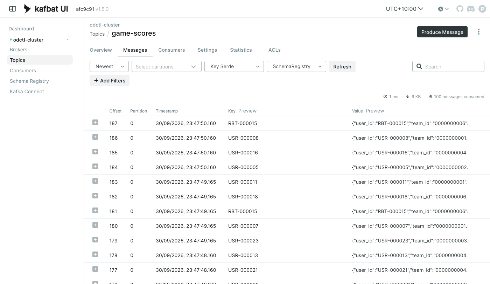
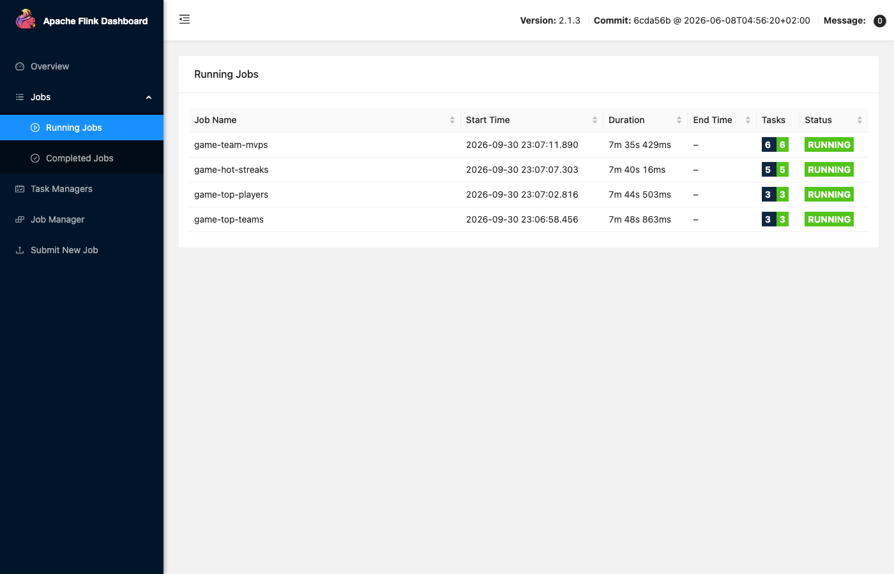
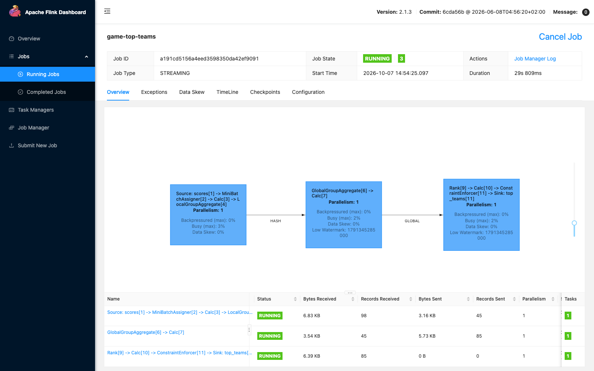
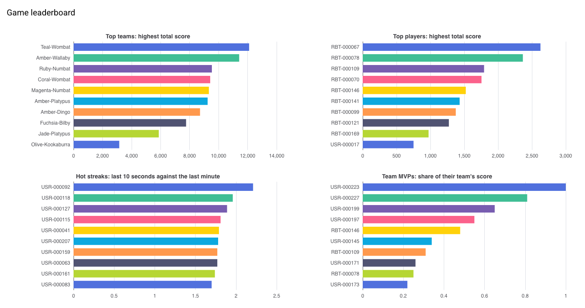
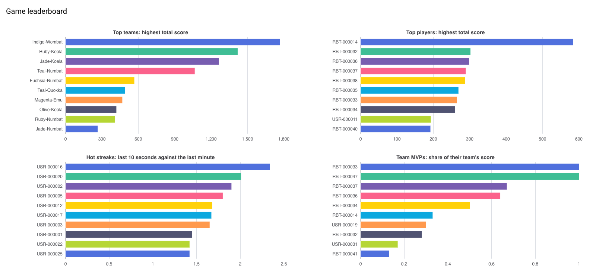

# Live Game Leaderboards with Flink SQL

Live leaderboards for a simulated mobile game. A simulation plays the game and sends every score to Kafka. Four Flink SQL jobs keep four top 10 leaderboards up to date in PostgreSQL, and a web dashboard shows them as they change. Everything runs on your own machine, and no step calls an external service.

It is described in a post: [Keeping Game Leaderboards Up to Date in Real Time with Kafka and Flink SQL](https://jaehyeon.me/blog/2026-10-02-game-leaderboard-flink-sql/).

More detail is in two documents:

- [Concepts](docs/concepts.md): the ideas the project is built on, from event time to Top-N queries, and where the code uses them.
- [Data](docs/data.md): the score event and the four leaderboard tables.

## Architecture


Four parts do the work:

- **Simulation:** plays the game in real time with [dynamic-des](https://github.com/jaehyeon-kim/dynamic-des), and sends each score to the Kafka topic `game-scores`.
- **Flink jobs:** one per leaderboard. Each reads the topic and keeps its leaderboard up to date as scores arrive. A Flink SQL query of this kind never finishes: it keeps its result current for as long as it runs. [Concepts](docs/concepts.md#continuous-queries-and-dynamic-tables) explains how.
- **PostgreSQL:** holds each leaderboard as a table with one row per rank.
- **Dashboard:** reads the four tables and redraws them every 2 seconds.

### What you will build

1. Run the simulation, which plays the game and sends each score to Kafka.
2. Submit the four Flink jobs, which keep the leaderboards up to date in PostgreSQL.
3. Open the dashboard, which shows the four leaderboards as they change.
4. Change the game while it runs: make every new player a robot, and watch robots take over the top players and the team MVPs, but not the hot streaks.

To start again at any point, `python -m leaderboard.stores.cleanup` removes everything this project has created and keeps the services running. See [Clean up](#clean-up).

The four leaderboards:

| Leaderboard | What it shows |
|---|---|
| Top teams | the 10 teams with the highest total score |
| Top players | the 10 players with the highest total score |
| Hot streaks | the 10 players scoring furthest above their usual rate: their average score over the last 10 seconds divided by their average over the last 60 seconds |
| Team MVPs | each team's top scorer and their share of the team's total, then the 10 players with the largest shares |

### Tools

| Tool | Role here |
|---|---|
| [dynamic-des](https://github.com/jaehyeon-kim/dynamic-des) | simulates the game, sends the scores to Kafka, and reads parameter changes from Kafka while it runs |
| Apache Kafka | carries the scores from the simulation to Flink |
| Karapace | the schema registry: it stores the Avro schema of the scores, so each message carries only a short schema id |
| Apache Flink | runs the four SQL jobs that compute the leaderboards |
| PostgreSQL | stores the leaderboards |
| NiceGUI | the dashboard, a web page served from one Python process |
| [odctl](https://github.com/jaehyeon-kim/odctl) | starts all the services above with Docker Compose |

## Environment setup

You need Docker (Docker Desktop, OrbStack or Docker Engine), [uv](https://docs.astral.sh/uv/) and Python 3.13. Run every command from this folder.

### Python environment

One virtual environment holds everything, including the `odctl` command:

```bash
uv venv                             # create .venv
source .venv/bin/activate           # activate it, in each new shell
uv pip install -r requirements.txt
```

### Services

```bash
odctl up kafka-lite flink-lite postgres
```

`odctl ps --all` lists the containers:

```text
🌟 Active Profiles: catalog, flink-lite, kafka-lite, postgres, storage

┏━━━━━━━━━━━━━━━━━━━━━┳━━━━━━━━━━━━━━━┳━━━━━━━━━┳━━━━━━━━━┳━━━━━━━━━━━━━━━━━━━━━━━━━━━━━━━━━━━━━━━━━━━━━━━━━━━━━━━━━┓
┃ Container           ┃ Service       ┃ State   ┃ Health  ┃ Ports                                                   ┃
┡━━━━━━━━━━━━━━━━━━━━━╇━━━━━━━━━━━━━━━╇━━━━━━━━━╇━━━━━━━━━╇━━━━━━━━━━━━━━━━━━━━━━━━━━━━━━━━━━━━━━━━━━━━━━━━━━━━━━━━━┩
│ connect             │ connect       │ running │ -       │ 8083 ➡️  8083/tcp                                       │
│ flink-jobmanager    │ jobmanager    │ running │ healthy │ 8082 ➡️  8081/tcp                                       │
│ flink-sql-gateway   │ sql-gateway   │ running │ -       │ 8084 ➡️  8083/tcp                                       │
│ flink-taskmanager-a │ taskmanager-a │ running │ -       │ -                                                       │
│ iceberg-catalog     │ catalog       │ running │ healthy │ 8181 ➡️  8181/tcp                                       │
│ kafka               │ kafka         │ running │ -       │ 29092 ➡️  29092/tcp, 9092 ➡️  9092/tcp                  │
│ kafka-ui            │ kafka-ui      │ running │ -       │ 8086 ➡️  8080/tcp                                       │
│ karapace            │ karapace      │ running │ healthy │ 8081 ➡️  8081/tcp                                       │
│ odctl-init-deps     │ init-deps     │ exited  │ -       │ -                                                       │
│ postgres            │ postgres      │ running │ healthy │ 5432 ➡️  5432/tcp                                       │
│ seaweed             │ seaweed       │ running │ healthy │ 8333 ➡️  8333/tcp, 8889 ➡️  8888/tcp, 9333 ➡️  9333/tcp │
│ seaweed-init        │ seaweed-init  │ exited  │ -       │ -                                                       │
└─────────────────────┴───────────────┴─────────┴─────────┴─────────────────────────────────────────────────────────┘
```

`kafka-lite` starts one Kafka broker, Karapace and Kafka UI. `flink-lite` starts a Flink cluster with one TaskManager, the worker process that runs jobs. It has 5 task slots, and each job here runs in one slot, so there is room for the four jobs. `postgres` starts PostgreSQL.

The web UIs:

- Kafka UI, for the topics and their messages: http://127.0.0.1:8086
- Flink UI, for the four running jobs: http://127.0.0.1:8082

The code connects to Kafka, Karapace, Flink and PostgreSQL at the addresses in [`leaderboard/core/config.py`](leaderboard/core/config.py), so there is nothing to configure.

## Step 1: Run the simulation

```bash
python -m leaderboard.simulation.run     # Ctrl + C to stop
```

It creates two Kafka topics if they are missing: `game-scores` for the scores, and `game-control` for parameter changes. Then it plays the game until you stop it:

- A player arrives every 2 seconds on average, and plays a session of about 5 minutes.
- A person plays a round about every 6 seconds, and a robot about every 1.5 seconds. 5% of players are robots.
- Each round earns a score from 0 to 20.
- 1% of scores are held for about 7 minutes, as if the phone were offline, and then sent with the time they were earned.

The number of players grows for the first few minutes, until as many leave as arrive, and then about 27 scores a second are sent. [Concepts](docs/concepts.md#a-discrete-event-simulation-of-the-game) describes the model.

Each score is sent in Avro, a compact binary format. The first score registers its schema in Karapace, under the subject `game-scores-value`, the name Karapace stores it by. In Kafka UI, open the topic `game-scores` and its **Messages** tab, and set **Value Serde** to `SchemaRegistry` to read them:



Each score names the player, their team, the score and the time it was earned. [Data](docs/data.md#score-events) lists the fields.

## Step 2: Submit the Flink jobs

In a second terminal, with the environment activated:

```bash
python -m leaderboard.jobs.submit
```

It does three things:

1. **Creates the tables.** It creates the PostgreSQL schema `game`, with the four leaderboard tables in [`tables.sql`](leaderboard/jobs/tables.sql).
2. **Adds a library to Flink.** It copies the OpenLineage client library into Flink's `lib` folder. Flink's JDBC connector, which writes to PostgreSQL, needs it, and odctl's Flink image has a copy, but not in that folder.
3. **Submits four jobs**, one per job file in [`leaderboard/jobs/`](leaderboard/jobs/), from [`01-top-teams.sql`](leaderboard/jobs/01-top-teams.sql) to [`04-team-mvps.sql`](leaderboard/jobs/04-team-mvps.sql). Each runs with the shared table definitions in [`00-ddl.sql`](leaderboard/jobs/00-ddl.sql). [Concepts](docs/concepts.md#four-jobs-and-one-init-file) explains why there are four jobs rather than one, and why the table definitions are loaded with each.

In the Flink UI, **Jobs** then **Running Jobs** lists the four jobs, all `RUNNING`:



Each job reads the topic from its first message, so the leaderboards include every score sent so far. Open a job to see its plan: a Kafka source, the aggregation and ranking, then a JDBC sink. [Concepts](docs/concepts.md#job-settings-state-mini-batch-and-checkpoints) explains the settings each job file sets.



Each leaderboard table holds 10 rows, one per rank. To see one in PostgreSQL:

```bash
docker exec postgres psql -U user -d odctl -c "SELECT * FROM game.top_teams ORDER BY rnk"
```

Run it again a few seconds later, and the totals have moved on. [Concepts](docs/concepts.md#top-n-with-row_number) explains how a query keeps a top 10, and [why the tables are keyed on the rank](docs/concepts.md#changelogs-and-sinks-keyed-on-the-rank). [Data](docs/data.md#leaderboard-tables) lists the columns.

## Step 3: Open the dashboard

```bash
python -m leaderboard.app.ui
```

Open http://127.0.0.1:8091. The four charts redraw every 2 seconds while the simulation and the jobs run:



For the first 10 minutes or so there are few teams, so some leaderboards have fewer than 10 rows. What to look at:

- **Top teams** and **top players** grow steadily. A score held while a phone was offline still counts when it arrives ([why](docs/concepts.md#event-time-and-processing-time)).
- **Hot streaks** change on every redraw. They run about 5 seconds behind the other charts, and leave out scores that arrive minutes late ([why](docs/concepts.md#over-windows-for-the-hot-streaks)).
- **Team MVPs** are led by the smallest teams, because a team of one gives its player a share of 1.0 ([why](docs/concepts.md#why-small-teams-lead-the-team-mvps)). A share can go just above 1.0 for a moment ([why](docs/concepts.md#joining-two-aggregates)).

## Step 4: Change the game while it runs

The simulation reads parameter changes from the topic `game-control`. It uses each new value from the next arrival or round. Make every new player a robot:

```bash
python -m leaderboard.simulation.control game.variables.robot_share 1.0
```

Players who are already playing keep their type until their sessions end, within about 5 minutes. Over those minutes, on the dashboard:

- **Top players** fills with robots (`RBT-...`). A robot plays a round about every 1.5 seconds, four times as often as a person, and its scores come from the same range, so its total grows four times as fast.
- **Top teams** changes as the robots' teams climb, because their totals grow faster.
- **Team MVPs** fills with robots, because a robot earns a large share of any team it joins.
- **Hot streaks** stays with people. A streak divides a player's average over the last 10 seconds by their average over the last minute. A robot plays 6 or 7 rounds in 10 seconds, so its short average stays close to its long one, and its ratio stays near 1. A person plays one or two rounds in 10 seconds, so one high score can double the short average.



To count the robots in the top players and the hot streaks in PostgreSQL:

```bash
docker exec postgres psql -U user -d odctl -c "SELECT 'top_players' AS board, count(*) FILTER (WHERE user_id LIKE 'RBT%') AS robots FROM game.top_players UNION ALL SELECT 'hot_streaks', count(*) FILTER (WHERE user_id LIKE 'RBT%') FROM game.hot_streaks"
```

Set it back when you have seen enough:

```bash
python -m leaderboard.simulation.control game.variables.robot_share 0.05
```

Other parameters work the same way. For example, `game.arrival.player.rate 2.0` brings four times as many players, and so four times as many scores. `python -m leaderboard.simulation.control --help` lists every parameter with its default.

## Tests

The tests need none of the services:

```bash
python -m pytest tests
```

They run the simulation as fast as possible and check its behaviour: sessions end, robots play about four times as often, late scores carry the time they were earned, teams fill and dissolve, and a live change takes effect. They check that each SQL file is its own named job with checkpoints and a state limit, and that every table's columns match between Flink and PostgreSQL. Others cover the serializer, the dashboard's queries, and which jobs the clean-up cancels. GitHub runs them after the lint checks on every push to `main`.

## Clean up

Stop the simulation and the dashboard first, then:

```bash
python -m leaderboard.stores.cleanup
```

It removes everything this project has created, and keeps the services running:

- **Flink:** the four jobs, which it cancels.
- **Kafka:** the topics `game-scores` and `game-control`.
- **Karapace:** the subject `game-scores-value`.
- **PostgreSQL:** the schema `game`, with its four tables.

It leaves other projects' jobs, topics and tables alone, and it is safe to run again. To start over, run the steps again from [Step 1](#step-1-run-the-simulation).

## Tear down

```bash
odctl down --all --volumes          # answer y; --volumes also deletes the data
deactivate
rm -rf .venv
```
