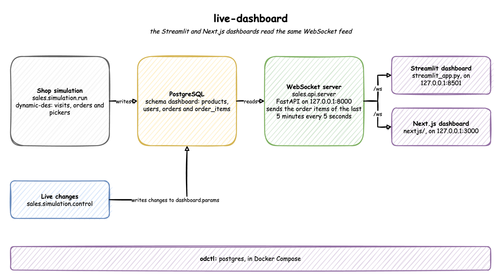
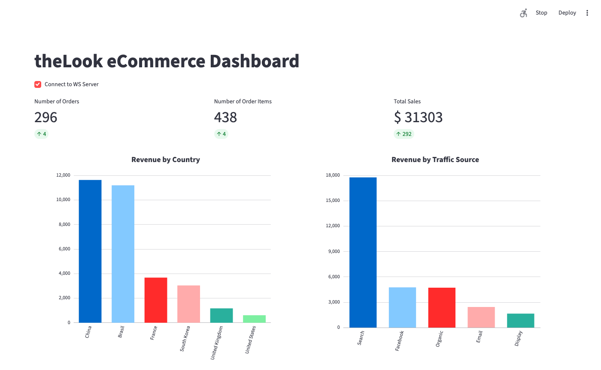
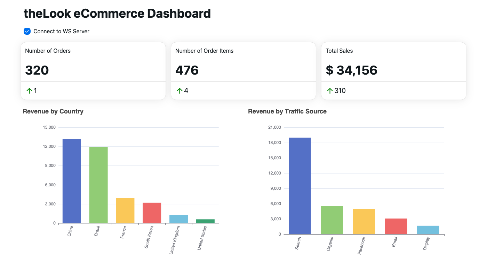

# Live Sales Dashboards

Two live dashboards of a simulated online shop, one built with Streamlit and one with Next.js. A simulation writes the shop's users, orders and order items to PostgreSQL as they happen. A WebSocket server sends the order items of the last five minutes to every open dashboard, every five seconds. Everything runs on your own machine, and no step calls an external service.

More detail is in two documents:

- [Concepts](docs/concepts.md): the ideas the project is built on, and where the code uses them.
- [Data](docs/data.md): every table's columns, and the records the server sends.

## Architecture



Three parts do the work:

- **Simulation:** plays the shop. Visitors arrive, browse and buy, and warehouse pickers pack the orders. It writes each new row, and each change to an order, to PostgreSQL.
- **WebSocket server:** reads the order items of the last five minutes and pushes them to each connected dashboard. [Concepts](docs/concepts.md#pushing-data-compared-with-polling-it) explains why the server pushes rather than the dashboards asking.
- **Dashboards:** turn each batch of records into three numbers (orders, order items and total sales) and two charts (revenue by country and by traffic source).

The two dashboards read the same feed, so they show the same numbers.

### What you will build

1. Start PostgreSQL, then the shop's simulation.
2. Start the WebSocket server, and watch its feed in a terminal client.
3. Open the Streamlit dashboard.
4. Open the Next.js dashboard beside it.
5. Change the simulation while it runs, and watch both dashboards follow.

To start again at any point, `python -m sales.stores.cleanup` removes everything this project has written and keeps the services running. See [Clean up](#clean-up).

### Tools

| Tool | Role here |
|---|---|
| [dynamic-des](https://github.com/jaehyeon-kim/dynamic-des) | simulates the shop, and writes every row to PostgreSQL |
| PostgreSQL | stores the shop's four tables, and the table of live changes |
| [FastAPI](https://fastapi.tiangolo.com/) | the WebSocket server |
| [Streamlit](https://streamlit.io/) | the Python dashboard |
| [Next.js](https://nextjs.org/) | the TypeScript and React dashboard |
| [Apache ECharts](https://echarts.apache.org/) | draws the charts in both dashboards |
| [odctl](https://github.com/jaehyeon-kim/odctl) | starts PostgreSQL with Docker Compose |

### Data

The shop is a simplified version of [theLook eCommerce](https://console.cloud.google.com/marketplace/product/bigquery-public-data/thelook-ecommerce). Its four tables are in the `dashboard` schema:

| Table | One row per |
|---|---|
| `products` | product: 260, from 26 categories, 2 departments and 5 brands |
| `users` | customer, with age, gender, country and traffic source |
| `orders` | order, with its status and number of items |
| `order_items` | product in an order, with its status and sale price |

[Data](docs/data.md) lists every column, and the fields of each record the server sends.

## Environment setup

You need Docker, [uv](https://docs.astral.sh/uv/) and Python 3.13 for everything, and Node.js with [pnpm](https://pnpm.io/installation) for the Next.js dashboard. Run every command from this folder.

### Python environment

One virtual environment holds everything, including the `odctl` command:

```bash
uv venv                             # create .venv
source .venv/bin/activate           # activate it, in each new shell
uv pip install -r requirements.txt
```

### Services

```bash
odctl up postgres                   # start PostgreSQL
```

`odctl ps --all` lists the containers:

```text
🌟 Active Profiles: postgres

┏━━━━━━━━━━━━━━━━━┳━━━━━━━━━━━┳━━━━━━━━━┳━━━━━━━━━┳━━━━━━━━━━━━━━━━━━━┓
┃ Container       ┃ Service   ┃ State   ┃ Health  ┃ Ports             ┃
┡━━━━━━━━━━━━━━━━━╇━━━━━━━━━━━╇━━━━━━━━━╇━━━━━━━━━╇━━━━━━━━━━━━━━━━━━━┩
│ odctl-init-deps │ init-deps │ exited  │ -       │ -                 │
│ postgres        │ postgres  │ running │ healthy │ 5432 ➡️  5432/tcp │
└─────────────────┴───────────┴─────────┴─────────┴───────────────────┘
```

The code connects to PostgreSQL at `127.0.0.1:5432`. [`sales/core/config.py`](./sales/core/config.py) sets the address and every other setting, so there is nothing to configure.

## Step 1: data producer

The simulation is a model of the shop in [dynamic-des](https://github.com/jaehyeon-kim/dynamic-des), a Python library for discrete-event simulation. It runs in real time: one simulated second takes one second. Start it in its own terminal:

```bash
python -m sales.simulation.run      # runs until Ctrl + C; --minutes 10 stops it after ten minutes
```

It creates the `dashboard` schema and its tables, writes the 260 products, and then writes about one order a second. Every choice is random. `--seed 7`, or any other number, makes the choices repeat from run to run.

The model, in short:

| Part of the shop | How it is modelled | dynamic-des feature |
|---|---|---|
| Visitors arrive, four a second on average | a random arrival stream | `add_arrival` and `arrival_loop` |
| A visitor views two to five pages, then may buy | a process with a wait per page | `spawn` and the `page_view` service time |
| A buyer is a new user, or a returning one | a chance, 60% returning | a registry variable |
| An order waits for one of 10 warehouse pickers, and is cancelled if none comes in time | a queue for a limited resource, raced against a patience time | `add_resource` and the `patience` service time |
| A packed order ships, reaches the customer, and is sometimes returned | timed steps, each changing the order's status | the `pick`, `transit` and `return_after` service times |
| Each row reaches PostgreSQL | inserted, or updated when an order's status changes | `PostgresEgress`, with `upsert_keys` for orders and items |
| Changes while the simulation runs | a parameter table the simulation reads every two seconds | `PostgresIngress` and the registry |

[Concepts](docs/concepts.md#discrete-event-simulation) explains each of these terms: events and processes, arrivals, service times, resources, patience and the registry.

To see the rows arrive, count them in PostgreSQL:

```bash
docker exec postgres psql -U user -d odctl -c "select status, count(*) from dashboard.orders group by 1"
```

Run it again after a minute. `Processing` orders are waiting for, or with, a picker. `Shipped` orders are on their way, and `Complete` orders have arrived.

Revenue by country over the last five minutes, the same numbers as the dashboards' revenue by country chart in [Step 3](#step-3-streamlit-dashboard):

```bash
docker exec postgres psql -U user -d odctl -c "select u.country, round(sum(o.sale_price)) from dashboard.order_items o join dashboard.users u on u.id = o.user_id where o.created_at::timestamptz >= clock_timestamp() - interval '5 minutes' group by 1 order by 2 desc"
```

## Step 2: WebSocket server

Start the server in a second terminal:

```bash
uvicorn sales.api.server:app --host 127.0.0.1 --port 8000
```

A dashboard connects to `ws://127.0.0.1:8000/ws`. On each connection, the server opens its own PostgreSQL connection. Every five seconds it reads the order items of the last five minutes, with their users and products, and sends them as one JSON list. [Concepts](docs/concepts.md#websockets-compared-with-http-requests) explains how a WebSocket differs from an HTTP request, and [the lookback window](docs/concepts.md#lookback-window-and-refresh-interval) what the five minutes and five seconds cost.

Watch the feed before opening a dashboard. The `websockets` package, which uvicorn installs, includes a terminal client:

```bash
python -m websockets ws://127.0.0.1:8000/ws
```

It prints `Connected to ws://127.0.0.1:8000/ws.`, then one line for each message, starting with `<`. Each message is the whole list of records, so it grows for the first five minutes and then stays about the same size. The server's terminal logs `Sending <n> records` for each message. Press Ctrl + C to close the client.

## Step 3: Streamlit dashboard

Start the Streamlit dashboard in a third terminal:

```bash
python -m streamlit run sales/dashboard/streamlit_app.py
```

Open http://127.0.0.1:8501 and tick **Connect to WS Server**. Every five seconds the page redraws:



- The three numbers count the orders, the order items and the total sales in the last five minutes.
- The small figure under each number is its change since the last message.
- The charts add up the sale prices by the user's country and by how the user found the shop.

The page is [`streamlit_app.py`](sales/dashboard/streamlit_app.py), and the calculations are in [`metrics.py`](sales/dashboard/metrics.py). [Concepts](docs/concepts.md#streamlits-rerun-model) explains how the page stays on screen while it waits for messages. Untick the box to stop the feed.

## Step 4: Next.js dashboard

Start the Next.js dashboard in a fourth terminal:

```bash
cd nextjs
pnpm install
pnpm dev
```

Open http://127.0.0.1:3000 and tick **Connect to WS Server**:



It shows the same numbers and charts as Streamlit, with an arrow on each card for the direction of the change. The page is [`page.tsx`](nextjs/src/app/page.tsx). It follows the WebSocket through the hook in [`useDashboard.ts`](nextjs/src/lib/useDashboard.ts), and [`processing.ts`](nextjs/src/lib/processing.ts) does the same calculations as [`metrics.py`](sales/dashboard/metrics.py). [Concepts](docs/concepts.md#react-state-and-effects) explains the hook and why the page is a client component.

Open both dashboards side by side. Each has its own WebSocket connection, and both receive the same records every five seconds.

## Step 5: change the simulation while it runs

`sales.simulation.control` writes a change to the parameter table, and the simulation applies it within two seconds. Double the visitors:

```bash
python -m sales.simulation.control sales.arrival.visitor.rate 8
```

Within seconds, the small change figure under each number roughly doubles, because twice as many orders arrive in each five seconds. The numbers themselves cover five minutes, so they reach about double five minutes after the change. Then send the pickers home:

```bash
python -m sales.simulation.control sales.resources.pickers.current_cap 0
```

New orders then wait for a picker until their patience runs out, about two minutes, and are cancelled. The dashboards count every order whatever its status, so their numbers do not change. The `orders` table shows the cancellations:

```bash
docker exec postgres psql -U user -d odctl -c "select status, count(*) from dashboard.orders where created_at::timestamptz > now() - interval '3 minutes' group by 1"
```

`python -m sales.simulation.control --help` lists every parameter and its default. A change stays in the parameter table, so a restarted simulation starts with it. To undo a change, send the default again, or run the clean-up. [Concepts](docs/concepts.md#live-changes-through-the-parameter-table) explains how the change reaches the running model.

## Tests

The tests need none of the services:

```bash
python -m pytest tests
(cd nextjs && pnpm test)
```

The Python tests run the model at full speed and check its rules: the catalogue is written first, a seed repeats a run, orders move only through valid statuses, buyers sign up before they order, the pickers limit how many orders are packed at once, and cutting the pickers or raising the visitor rate has the expected effect. They also cover the row bounds, the dashboard calculations and the server's query. The Vitest tests cover the Next.js calculations. GitHub runs both, after the repository's lint checks, on every push to `main`.

## Clean up

`python -m sales.stores.cleanup` drops the `dashboard` schema with its four tables and the parameter table. It touches nothing else in PostgreSQL. Run it to start again, without restarting the services:

```bash
python -m sales.stores.cleanup
```

## Tear down

```bash
odctl down --all --volumes          # answer y; --volumes also deletes the data
deactivate
rm -rf .venv
```

## Posts

- [Realtime Dashboard with FastAPI, Streamlit and Next.js - Part 1 Data Producer](https://jaehyeon.me/blog/2025-02-18-realtime-dashboard-1/)
- [Streamlit Dashboard - Realtime Dashboard with FastAPI, Streamlit and Next.js Part 2](https://jaehyeon.me/blog/2025-02-25-realtime-dashboard-2/)
- [Next.js Dashboard - Realtime Dashboard with FastAPI, Streamlit and Next.js Part 3](https://jaehyeon.me/blog/2025-03-04-realtime-dashboard-3/)
