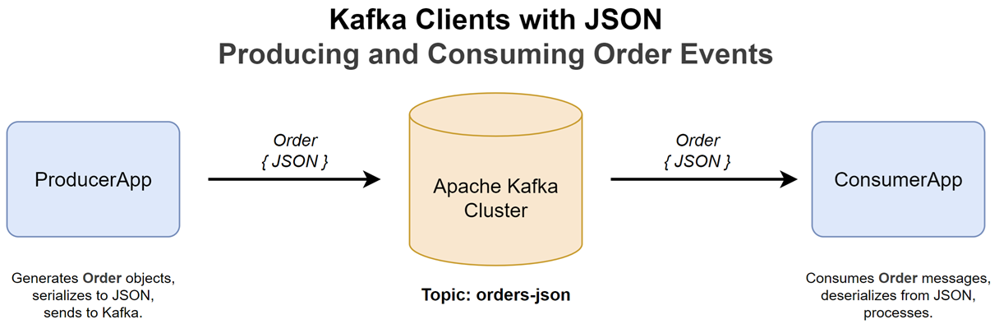
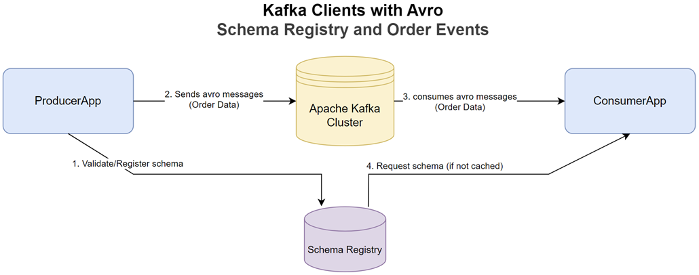
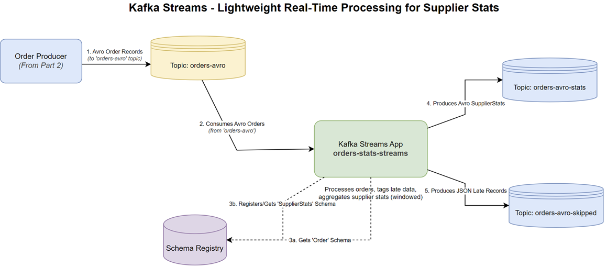
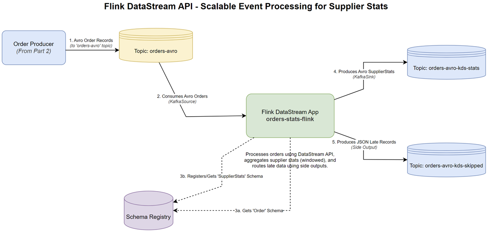
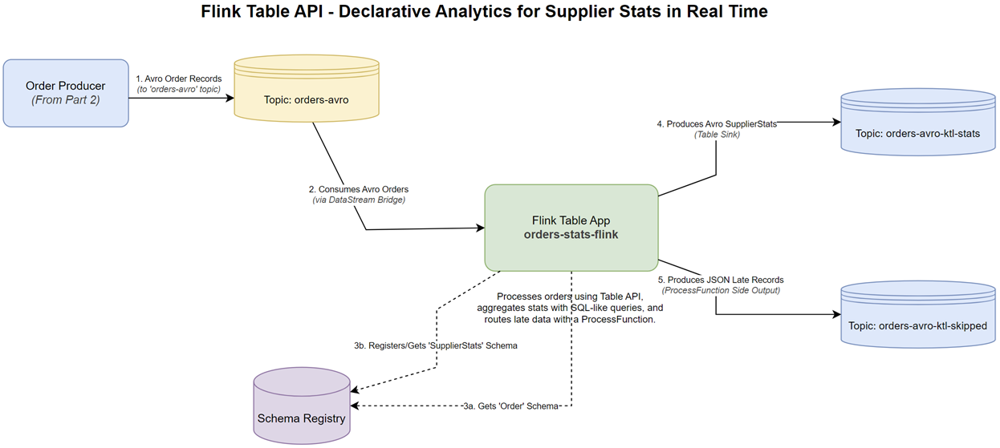

# order-streams

Four Kotlin applications that produce, consume and aggregate one stream of order events on Apache Kafka. They start with the plain Kafka clients, first with JSON and then with Avro. Then they compute the same supplier statistics twice: with Kafka Streams, and with Apache Flink.

Each order has an id, a bid time, a price, an item and a supplier. The statistics are the total price and the number of orders for each supplier in 5-second windows. An order that arrives too late for its window goes to a separate "skipped" topic instead.

[Concepts](docs/concepts.md) explains the ideas each step uses: partitions, consumer groups, schemas, windows and watermarks. Each step links to the part it needs.

It is described in a series of five posts:

- [Kafka Clients with JSON - Producing and Consuming Order Events](https://jaehyeon.me/blog/2025-05-20-kotlin-getting-started-kafka-json-clients/)
- [Kafka Clients with Avro - Schema Registry and Order Events](https://jaehyeon.me/blog/2025-05-27-kotlin-getting-started-kafka-avro-clients/)
- [Kafka Streams - Lightweight Real-Time Processing for Supplier Stats](https://jaehyeon.me/blog/2025-06-03-kotlin-getting-started-kafka-streams/)
- [Flink DataStream API - Scalable Event Processing for Supplier Stats](https://jaehyeon.me/blog/2025-06-10-kotlin-getting-started-flink-datastream/)
- [Flink Table API - Declarative Analytics for Supplier Stats in Real Time](https://jaehyeon.me/blog/2025-06-17-kotlin-getting-started-flink-table/)

## Architecture

All four applications use one Kafka broker. The producers write orders to a topic, and every other application reads that topic.

### What you will build

1. **JSON clients:** a producer writes one order a second to the topic `orders-json`, and a consumer reads them back.
2. **Avro clients:** the same with Avro, a binary format whose schema is kept in a schema registry. The producer writes to `orders-avro`, which every later step reads.
3. **Kafka Streams:** an application that reads `orders-avro`, sums the orders per supplier in 5-second windows, and routes late orders to a skipped topic.
4. **Flink DataStream API:** the same statistics as a Flink job written with Flink's lower-level API.
5. **Flink Table API:** the same statistics again, written as a table query.

Steps 3 to 5 need the Avro producer from step 2 running. To start again at any point, stop the applications, run [Tear down](#tear-down), which removes every topic, and start the services again.

### Tools

| Tool | Role here |
|---|---|
| Apache Kafka 3.9 clients | the producers and consumers |
| Karapace | the schema registry, which stores the Avro schemas |
| Confluent serializers 7.9 | turn Avro records into bytes and back |
| Kafka Streams 3.9 | a stream processing library that runs inside the application |
| Apache Flink 1.20 | a stream processing engine, here running inside the application's own process |
| Kafka UI | a web page showing topics, messages, consumer groups and schemas |
| Gradle | the build tool; the four applications are subprojects of one build |
| [odctl](https://github.com/jaehyeon-kim/odctl) | starts Kafka, Karapace and Kafka UI with Docker Compose |

## Environment setup

You need Docker (Docker Desktop, OrbStack or Docker Engine), JDK 17 and odctl. Install odctl with [uv](https://docs.astral.sh/uv/):

```bash
uv tool install odctl==0.9.0
```

`./gradlew` downloads Gradle on its first run. Run every command from this folder.

Start the services:

```bash
odctl up kafka-lite
```

`kafka-lite` runs one Kafka broker on `127.0.0.1:9092`, Karapace on `http://127.0.0.1:8081` and Kafka UI on http://127.0.0.1:8086. The applications use those addresses by default, so there is nothing to configure.

Flink needs no service here. The Flink application starts a small Flink cluster inside its own process.

## Step 1: JSON clients



Run the producer, then the consumer in a second terminal:

```bash
./gradlew :orders-json-clients:run --args="producer"
./gradlew :orders-json-clients:run --args="consumer"
```

The producer creates the topic `orders-json` with three partitions and sends one order a second, keyed by its order id. It waits for Kafka to confirm each send, and logs the partition and offset the order was written to ([topics, partitions and keys](docs/concepts.md#topics-partitions-and-keys), [producers](docs/concepts.md#producers)). A serializer written for this project turns each order into JSON with snake_case field names, such as `order_id` ([serialization](docs/concepts.md#serialization-json-and-avro)).

The consumer joins the consumer group `orders-json-group`, reads from the earliest offset, and commits its offsets after each batch it polls ([consumers](docs/concepts.md#consumers-groups-and-offsets)).

In Kafka UI:

- **Topics > orders-json > Messages:** each order as JSON, with its key, partition and offset, spread over the three partitions.
- **Consumers > orders-json-group:** the group's lag, the number of records it has not read yet. Stop the consumer and the lag grows. Start it again and it carries on from its last committed offset.

## Step 2: Avro clients



```bash
./gradlew :orders-avro-clients:run --args="producer"
./gradlew :orders-avro-clients:run --args="consumer"     # in a second terminal
```

The producer creates the topic `orders-avro` and sends one order a second, like the JSON producer, but in Avro. The order is generated from the schema in `orders-avro-clients/src/main/avro/Order.avsc`, which the serializer registers in Karapace under the subject `orders-avro-value` ([serialization](docs/concepts.md#serialization-json-and-avro)).

In Kafka UI:

- **Schema Registry > orders-avro-value:** the registered schema, its version and its compatibility level, `BACKWARD`.
- **Topics > orders-avro > Messages:** set **Value Serde** to `SchemaRegistry`, and Kafka UI decodes each message with the schema.
- **Consumers > orders-avro-group:** the Avro consumer's group, which works as in step 1.

Keep the producer running for the next three steps: they all read `orders-avro`.

### Late orders

Each order's bid time is a random time up to `DELAY_SECONDS` before it is sent, 5 seconds by default. With the default, no order is late. To see late orders, restart the producer with a larger delay: 15 seconds for Kafka Streams in step 3, and 30 seconds for the Flink jobs in steps 4 and 5, which accept an order for longer ([why](docs/concepts.md#why-delay_seconds-makes-orders-late)):

```bash
DELAY_SECONDS=15 ./gradlew :orders-avro-clients:run --args="producer"    # for step 3
DELAY_SECONDS=30 ./gradlew :orders-avro-clients:run --args="producer"    # for steps 4 and 5
```

## Step 3: Kafka Streams



```bash
./gradlew :orders-stats-streams:run
```

The application creates the topics `orders-avro-stats` and `orders-avro-skipped`, then runs its topology ([Kafka Streams](docs/concepts.md#kafka-streams)):

1. **Read** `orders-avro`, taking each order's bid time as its timestamp.
2. **Tag** each order late or on time, against the stream time.
3. **Write** late orders as JSON, with `"late": true` added, to `orders-avro-skipped`.
4. **Aggregate** the rest by supplier, in 5-second tumbling windows with a 5-second grace period.
5. **Write** each window's total price and count to `orders-avro-stats` in Avro.

In Kafka UI:

- **Topics > orders-avro-stats:** the window results. Set **Value Serde** to `SchemaRegistry` to decode them with the `SupplierStats` schema. They arrive in bursts, about every 30 seconds, when Kafka Streams commits.
- **Topics > orders-avro-skipped:** the late orders, as plain JSON. It stays empty unless the producer runs with `DELAY_SECONDS=15`.
- **Consumers > orders-avro-stats-kafka-streams:** the application's consumer group, named after its application id.
- **Topics:** two internal topics starting with `orders-avro-stats-kafka-streams-`: the orders re-keyed by supplier, and the changelog of the window totals.

## Step 4: Flink DataStream API



```bash
./gradlew :orders-stats-flink:run --args="datastream"
```

The job creates the topics `orders-avro-kds-stats` and `orders-avro-kds-skipped`, and runs three copies of each operator, one per partition ([Flink](docs/concepts.md#flink-watermarks-and-windows)):

1. **Read** `orders-avro` from the earliest offset.
2. **Assign** each order its bid time as its timestamp, with watermarks that trail the largest timestamp by 5 seconds.
3. **Aggregate** by supplier in 5-second tumbling event-time windows, with an allowed lateness of 5 seconds, and write the results in Avro to `orders-avro-kds-stats`.
4. **Send** late orders to a side output, written as JSON to `orders-avro-kds-skipped`.

The job also prints each result and each late order to the terminal. In Kafka UI, `orders-avro-kds-stats` needs **Value Serde** set to `SchemaRegistry`, and `orders-avro-kds-skipped` holds plain JSON. The skipped topic stays empty unless the producer runs with `DELAY_SECONDS=30`.

## Step 5: Flink Table API



```bash
./gradlew :orders-stats-flink:run --args="table"
```

The same statistics, written as a table query ([DataStream API and Table API](docs/concepts.md#datastream-api-and-table-api)). The job creates `orders-avro-ktl-stats` and `orders-avro-ktl-skipped`, then:

1. **Read** `orders-avro` and assign timestamps and watermarks, as in step 4.
2. **Route** any order older than the watermark minus 5 seconds to a side output, written as JSON to `orders-avro-ktl-skipped`.
3. **Register** the rest as the table `orders`, with `bid_time` as its time column.
4. **Query** it: a 5-second tumbling window on `bid_time`, grouped by supplier, with the total price and the count.
5. **Write** the result in Avro to `orders-avro-ktl-stats`, through Flink's Kafka table connector.

As in step 4, the job prints its results and late orders to the terminal, and Kafka UI shows both topics. `orders-avro-ktl-skipped` stays empty unless the producer runs with `DELAY_SECONDS=30`.

## Fat JARs

Each application also builds into one JAR that holds all its dependencies, and runs with `java -jar`:

```bash
./gradlew shadowJar
java -jar orders-avro-clients/build/libs/orders-avro-clients-1.0.jar producer
java -jar orders-stats-streams/build/libs/orders-stats-streams-1.0.jar
java --add-opens=java.base/java.util=ALL-UNNAMED -jar orders-stats-flink/build/libs/orders-stats-flink-1.0.jar datastream
```

Flink needs `--add-opens` for reflective access to `java.util` on JDK 17, which Gradle adds for `run`. `BOOTSTRAP` and `REGISTRY_URL` change the addresses, and `BOOTSTRAP_ADDRESS` does for the JSON clients. The Flink JAR prints to the terminal only with `TO_SKIP_PRINT=false`, which Gradle's `run` sets.

## Tests

The tests need none of the services:

```bash
./gradlew test ktlintCheck
```

They cover the JSON and Avro serializers, the Kafka Streams topology with Kafka's test driver (including a late order going to the skipped topic), and the Flink aggregator, window function and late-order router. `ktlintCheck` checks the Kotlin code style. GitHub runs both, after the repository's lint checks, on every push to `main`.

## Tear down

Stop the applications with Ctrl + C, then:

```bash
odctl down kafka-lite
```

The broker keeps its data inside its container, so removing the container also removes the topics.
