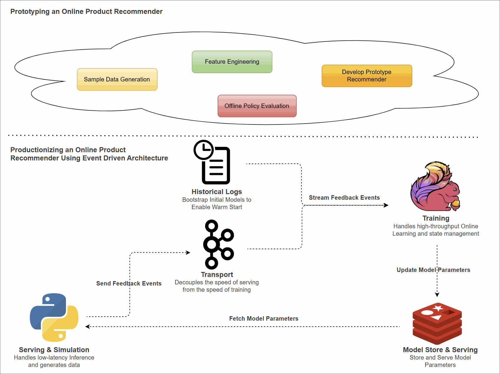
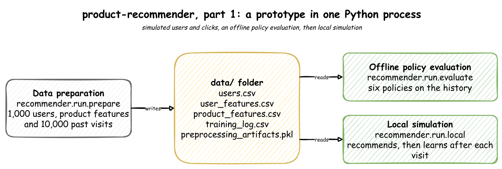
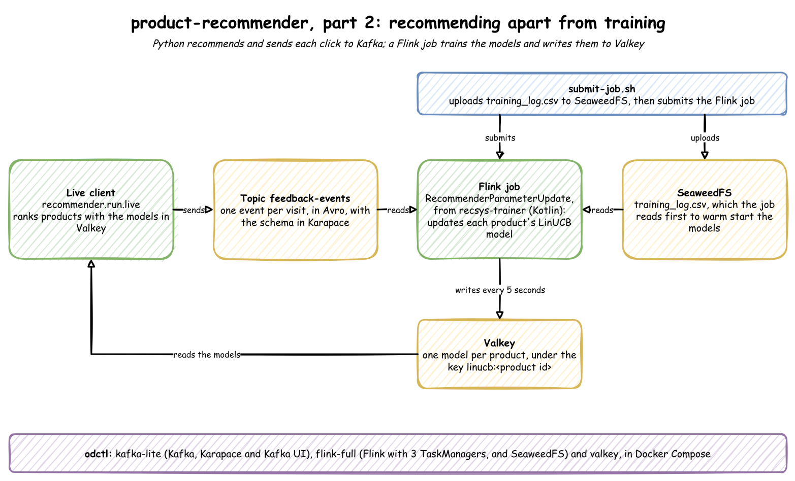

# product-recommender

An online product recommender that learns from every click as it happens. It starts as a prototype in one Python process, then becomes an event-driven system: Python recommends, Kafka carries each click, a Flink job trains the models, and Valkey holds them. Everything runs on your own machine.



It is described in two posts:

- [Prototyping an Online Product Recommender in Python](https://jaehyeon.me/blog/2026-01-29-prototype-recommender-with-python/): simulates users and clicks, compares recommenders, and tests the chosen one in one process.
- [Productionizing an Online Product Recommender using Event Driven Architecture](https://jaehyeon.me/blog/2026-02-23-productionize-recommender-with-eda/): separates recommending from training.

More detail is in two documents:

- [Concepts](docs/concepts.md): how a bandit recommender works, how it is evaluated, and why the system is split the way it is.
- [Data](docs/data.md): every file, topic and key the steps read and write.

## Architecture

The recommender is a **contextual bandit**: for each visit it shows five products, sees whether one is clicked, and learns from what is known about the visit, such as the user's age and the time of day. The algorithm is **LinUCB**, one small linear model per product. [Concepts](docs/concepts.md#bandits) explains both from the start. The users and clicks are simulated, and a hidden formula decides each click, so there is a pattern to find.

### What you will build

**Step 1: a prototype in one Python process**



1. Generate 1,000 users, the features of 200 products, and a history of 10,000 past visits.
2. Compare six recommenders on that history, and pick LinUCB.
3. Run LinUCB for 30 simulated visits, learning after each one.

**Step 2: an event-driven system**



1. Build the Flink job, start the services, and submit the job. It trains the models on the history first.
2. Run the live client. It recommends from the models in Valkey and sends each result to Kafka.
3. Watch the Flink job pick up the results and write the updated models back.

Step 1 needs no services. Step 2 runs them with odctl.

To start again at any point, `python -m recommender.stores.cleanup` removes what Step 2 wrote to the services and keeps them running. See [Clean up](#clean-up).

### Tools

| Tool | Role here |
|---|---|
| [MABWiser](https://github.com/fidelity/mabwiser) | LinUCB in the prototype |
| [Mab2Rec](https://github.com/fidelity/mab2rec) and [Jurity](https://github.com/fidelity/jurity) | the offline comparison and its scores |
| [TextWiser](https://github.com/fidelity/textwiser) | turns each product's name and description into numbers |
| Faker | generates the users, the visit times and the clicks |
| Apache Kafka | carries the feedback events, encoded with Avro, with the schema kept in Karapace, the schema registry |
| Apache Flink | runs the trainer, written in Kotlin, as a job that runs until it is cancelled |
| Valkey | an in-memory key-value store, compatible with Redis, that holds each product's model |
| SeaweedFS | an S3-compatible object store, from which the Flink job reads the history |
| [odctl](https://github.com/jaehyeon-kim/odctl) | starts Kafka, Flink, Valkey and SeaweedFS with Docker Compose |

## Environment setup

You need Docker, [uv](https://docs.astral.sh/uv/), Python 3.11 and a JDK 17. Run every command from this folder.

The project needs Python 3.11. It pins `pandas<2.0`, and the last pandas 1.x release, 1.5.3, publishes no wheels for Python 3.12 or later.

```bash
uv venv --python 3.11 .venv          # create .venv
source .venv/bin/activate            # activate it, in each new shell
uv pip install -r requirements.txt   # includes the odctl command
```

## Step 1: prototype in Python

These steps need none of the services. Each accepts `--seed`, which defaults to 1237. The same seed always gives the same output, so your run matches the output below.

### Prepare the data

```bash
python -m recommender.run.prepare
```

It writes three things to `data/`, listed in [Data](docs/data.md):

- **Users:** 1,000 users, each with an age, a gender, a Melbourne postal area and a traffic source.
- **Features:** each user and product as numbers, which [Concepts](docs/concepts.md#features-and-the-context-vector) explains.
- **History:** 10,000 past visits, each a random user shown a random product, with the [hidden click formula](docs/concepts.md#hidden-click-formula) deciding the click.

The last lines of its output:

```
Done. Saved Training Log to .../training_log.csv
Avg Click Rate: 13.65%
```

13.65% is the click rate of showing products at random. It is the rate a recommender has to beat.

### Compare six recommenders

```bash
python -m recommender.run.evaluate
```

This is **offline policy evaluation**: six policies, the rules that pick what to show, each train on the first 8,000 visits of the history and are scored on the last 2,000:

```
            AUC(score)@5  CTR(score)@5  Precision@5  Recall@5
Random          0.550000      0.102041     0.003876  0.019380
Popularity      0.592857      0.192308     0.007752  0.038760
LinGreedy       0.885185      0.117647     0.004651  0.023256
LinUCB          0.860317      0.204545     0.006977  0.034884
LinTS           0.640798      0.211538     0.008527  0.042636
ClustersTS      0.550505      0.153846     0.004651  0.023256
```

A visit is scored only when its logged product is among the policy's five. `CTR(score)@5` is the click rate on those visits: LinUCB's 20.5% is double Random's 10.2%, and its ranking score, `AUC(score)@5`, is close to the best, so LinUCB is chosen. [Concepts](docs/concepts.md#offline-policy-evaluation) explains each column and policy.

### Run LinUCB locally

```bash
python -m recommender.run.local
```

It trains LinUCB on the whole history, then serves 30 visits, learning from each one straight away ([online learning](docs/concepts.md#online-learning)). Each line is one visit. These are visits 21 and 30:

```
User 0552 (39 yo) @ Tue 11:33 -> Recs: [192, 190, 189, 194, 193] -> Clicked: 192 (✅)
User 0508 (64 yo) @ Tue 12:41 -> Recs: [165, 087, 026, 171, 037] -> Clicked: 165 (❌)
```

- The user, their age and the visit time.
- The five products recommended, best first.
- The product clicked with ✅, or, when no product was clicked, the first one shown with ❌.

Visit 21 is on a Tuesday morning, and all five recommendations are coffees, products 189 to 194. Visit 30 is on the same Tuesday, 41 minutes after the morning ends at 12:00, and no coffee is shown. The time of day is part of the context, and the history taught it that coffee is clicked in the morning. Across the 30 visits, 16 end in a click, 53%, against 13.65% at random. [Concepts](docs/concepts.md#linucb) explains how LinUCB scores.

## Step 2: event-driven system

Step 2 splits the prototype's work in two ([why](docs/concepts.md#splitting-serving-from-training)):

- **Serving:** `python -m recommender.run.live` reads every product's model from Valkey, recommends the five highest-scoring products, and sends the visit's result to the Kafka topic `feedback-events`.
- **Training:** the Flink job `RecommenderParameterUpdate` reads the history, then every feedback event. Every 5 seconds it writes each changed model to Valkey, under the key `linucb:<product id>`.

### Start the services

```bash
(cd recsys-trainer && ./gradlew shadowJar)   # build the Flink job's JAR
odctl init                                   # copy odctl's configuration into ./.odctl
odctl up kafka-lite flink-full valkey        # Kafka, Flink with 3 TaskManagers, and Valkey
```

`./gradlew` downloads Gradle and the dependencies the first time, which takes a few minutes. `flink-full` also starts SeaweedFS, which the job reads the history from.

The web UIs:

- Flink: http://127.0.0.1:8082
- Kafka UI: http://127.0.0.1:8086
- SeaweedFS file browser: http://127.0.0.1:8889

### Submit the Flink job

Step 2 needs the history from `python -m recommender.run.prepare`.

```bash
./submit-job.sh
```

It does three things:

1. Uploads `data/training_log.csv` to SeaweedFS. The JobManager and the three TaskManagers are separate containers that all read the file, so it has to be somewhere they can all reach.
2. Copies the JAR into the JobManager container.
3. Submits the job with `flink run -d`, which returns once the job is running.

In the Flink UI, the job `RecommenderParameterUpdate` shows as running. It reads the 10,000 visits of the history first, then waits for feedback events. [Concepts](docs/concepts.md#flink-job) explains what it keeps and when it writes.

To list the models it has written:

```bash
docker exec valkey valkey-cli --user user --pass password --no-auth-warning --scan --pattern 'linucb:*' | head
```

### Run the live client

```bash
python -m recommender.run.live
```

It serves a visit every 0.1 seconds until Ctrl+C, printed as in Step 1. For each visit it reads all 200 models from Valkey in one request, shows the five best, and sends a feedback event to Kafka with the product, the reward (1 for a click, 0 for none) and the context.

To see the job write the models, watch a TaskManager's log in a second terminal:

```bash
docker logs flink-taskmanager-a -f
```

A line such as `Updated model for Product 192 in batch` appears each time the job writes a product's model to Valkey. The feedback events are in Kafka UI, under the topic `feedback-events`. [Concepts](docs/concepts.md#valkey-as-the-model-store) explains why the client reads every model on every visit.

## Tests

The tests need none of the services:

```bash
python -m pytest tests                  # data generation, features, the simulation and the bandit
(cd recsys-trainer && ./gradlew test)   # the LinUCB update, feedback parsing and the model's JSON
```

They check, for example, that a seed repeats the users and clicks, that a click moves a product up the ranking, and that the Flink job updates `A` and `b` as LinUCB does. GitHub runs both after the lint checks on every push to `main`.

## Troubleshooting

| What you see | Cause and fix |
|---|---|
| `uv pip install` builds pandas from source, or fails | The environment is not Python 3.11: recreate it with `uv venv --python 3.11 .venv`. |
| `JAR not found at recsys-trainer/build/libs/recsys-trainer-1.0.jar` | Build the JAR first: `(cd recsys-trainer && ./gradlew shadowJar)`. |
| `Bootstrap CSV not found at data/training_log.csv` | Run `python -m recommender.run.prepare` first. |
| The live client or the clean-up first prints `AuthlibDeprecationWarning: The httpx module is deprecated` | A notice from `authlib`, which the schema registry client imports. It does no harm. |

## Clean up

`python -m recommender.stores.cleanup` removes what Step 2 wrote to the services, and keeps them running:

- **Flink:** cancels the job `RecommenderParameterUpdate` first, so it cannot write a model after the models are deleted.
- **Valkey:** deletes every `linucb:*` key. Without this, a new run starts from the last run's models.
- **Kafka:** deletes the topic `feedback-events`, which a new job would otherwise read from its first event. The job creates it again.
- **Schema registry:** deletes the subject `feedback-events-value`, the feedback event's schema.

Each part is skipped when it is already gone, so running it twice is safe. The files in `data/` stay, and `prepare` writes the same files again.

```bash
python -m recommender.stores.cleanup
```

## Tear down

```bash
odctl down --all --volumes          # answer y; --volumes also deletes the data
deactivate
rm -rf .venv
```
